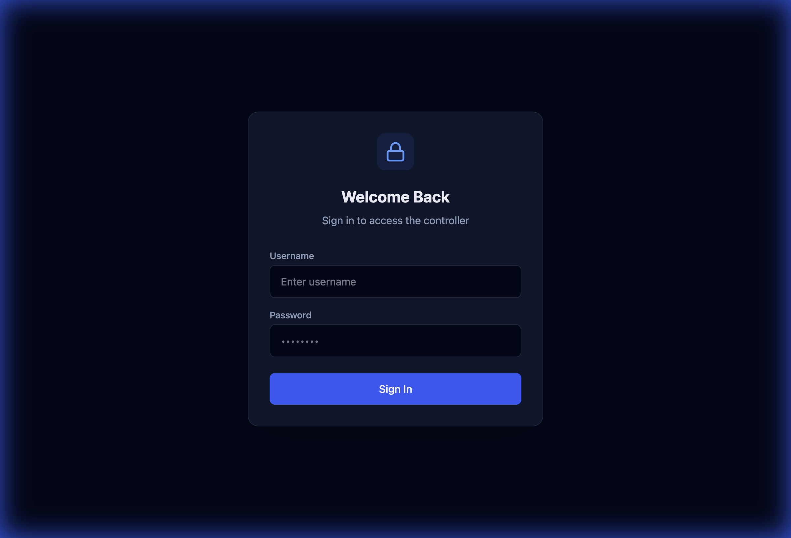
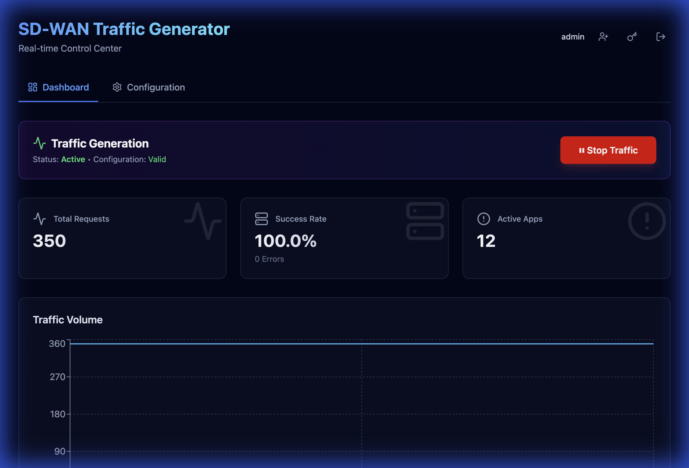
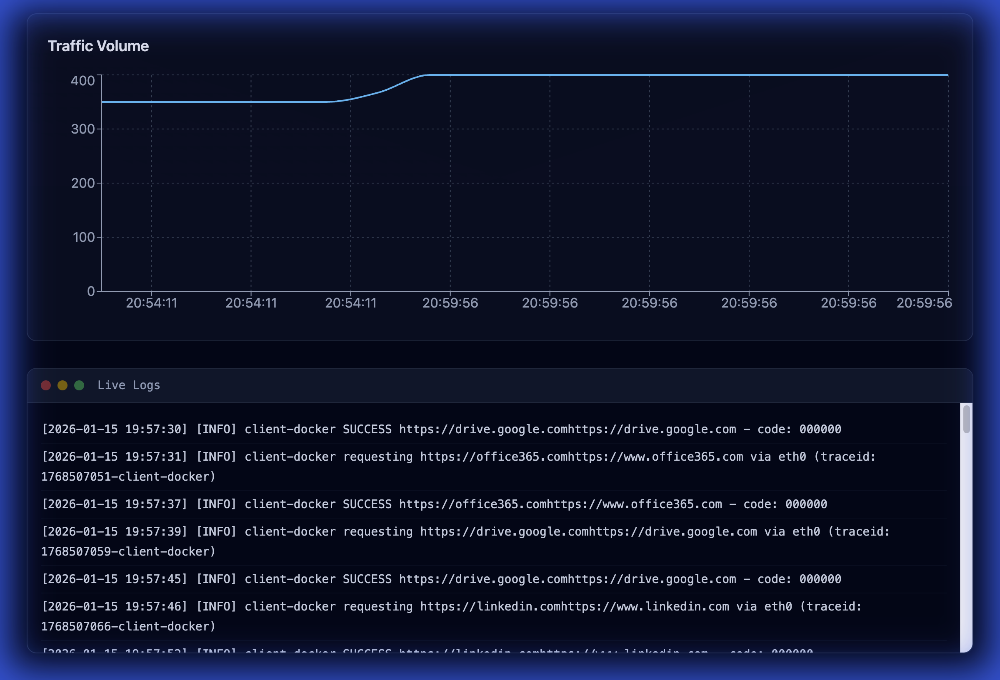
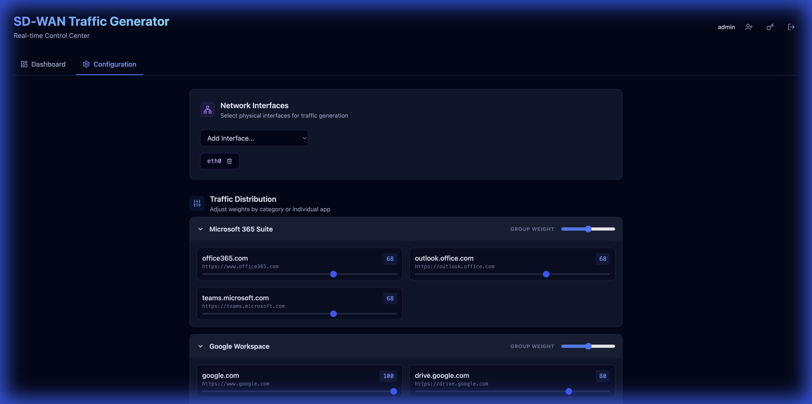

# SD-WAN Traffic Generator


A realistic enterprise application traffic generator designed for SD-WAN testing and demonstrations. It simulates various application traffic patterns (HTTP/HTTPS) to generate load and test application-aware network policies.

**Now featuring a modern Web Dashboard with real-time monitoring and comprehensive security testing!**

## ✨ Features

### Traffic Generation
-   **🎯 Real-time Dashboard**: Live traffic visualization, metrics, and status monitoring
-   **⚙️ Configuration UI**: Easily adjust application weights and network interfaces from your browser
-   **🌐 Realistic Patterns**: Randomly selected user agents and weighted application distribution (Microsoft 365, Google Workspace, and 140+ enterprise/consumer apps)
-   **📊 Live Logging**: Real-time log streaming and detailed statistics
-   **🔄 Intelligent Backoff**: Automatic retry logic for failed requests

### Security Testing (v1.1.0)
-   **🛡️ URL Filtering**: Test 66 different URL categories (malware, phishing, gambling, adult content, etc.)
-   **🔒 DNS Security**: Validate DNS security policies with 24 test domains (malware, phishing, DGA, etc.)
-   **⚠️ Threat Prevention**: EICAR file download testing for IPS validation
-   **📅 Scheduled Testing**: Automated security tests at configurable intervals
-   **📈 Test Results History**: Persistent logging with search, filtering, and export

### Persistent Logging (v1.1.0)
-   **💾 JSONL Storage**: Structured, searchable test results
-   **🔄 Auto Rotation**: Size and age-based log cleanup (7-day retention)
-   **🔍 Search & Filter**: Find specific tests quickly with powerful search
-   **📤 Export**: Download results in JSON, CSV, or JSONL format
-   **📊 System Health**: Monitor memory, disk usage, and log size

### Deployment
-   **🐳 Docker Ready**: Single-command deployment using Docker Compose
-   **🔒 Secure**: Built-in authentication with JWT tokens
-   **🚀 Production Ready**: Log rotation, health monitoring, and automatic cleanup

---

## 📸 Screenshots

### Login Interface


### Dashboard - Real-time Monitoring


*Monitor traffic generation status, total requests, success rate, and active applications in real-time*

### Security Testing - URL Filtering


*Test 66 different URL categories to validate firewall policies*

### Security Testing - DNS Security


*Validate DNS security with malware, phishing, and advanced threat domains*

### Security Testing - Test Results


*Search, filter, and export security test results with persistent logging*

### Live Logs & Statistics


*View traffic volume charts and live log streaming*

### Configuration Management


*Manage network interfaces and adjust traffic distribution weights for different application suites*

---

## 🚀 Quick Start

### Option 1: Using Docker Hub (Recommended)

Pull and run pre-built images directly from Docker Hub:

```bash
# Create a docker-compose.yml file
curl -O https://raw.githubusercontent.com/jsuzanne/sdwan-traffic-generator-web/main/docker-compose.yml

# Start the services
docker-compose up -d

# Access the dashboard
open http://localhost:8080
```

**Default credentials:** `admin` / `admin` (change after first login)

### Option 2: Build from Source

```bash
# Clone the repository
git clone https://github.com/jsuzanne/sdwan-traffic-generator-web.git
cd sdwan-traffic-generator-web

# Build and start
docker-compose up -d --build

# Access the dashboard
open http://localhost:8080
```

---

## 🔧 Configuration

### Environment Variables

Create a `.env` file to customize your deployment:

```bash
# Web UI Port (default: 8080)
WEB_UI_PORT=8080

# JWT Secret (change in production!)
JWT_SECRET=your-secret-key-here

# Traffic Generation Settings
SLEEP_BETWEEN_REQUESTS=1

# Paths (usually don't need to change)
CONFIG_DIR=/app/config
LOG_DIR=/var/log/sdwan-traffic-gen
```

### Port Conflicts

If port 8080 is already in use:

```bash
# Option 1: Use .env file
echo "WEB_UI_PORT=8081" > .env
docker-compose up -d

# Option 2: Modify docker-compose.yml
# Change ports section to: "8081:8080"
```

---

## 📖 Usage

### Managing Traffic Generation

1. **Login** to the web dashboard at `http://localhost:8080`
2. **Dashboard Tab**: View real-time statistics and control traffic generation
3. **Configuration Tab**: 
   - Add network interfaces (e.g., `eth0`, `wlan0`)
   - Adjust traffic distribution weights for different application categories
   - Changes are applied immediately
4. **Start/Stop**: Use the toggle button on the dashboard

### Docker Management

```bash
# View logs
docker-compose logs -f

# View specific service logs
docker-compose logs -f web-ui
docker-compose logs -f traffic-gen

# Restart services
docker-compose restart

# Stop services
docker-compose down

# Update to latest version
docker-compose pull
docker-compose up -d
```

---

## 🏗️ Architecture

```
┌─────────────────────────────────────────┐
│         Web Dashboard (React)           │
│    Port 8080 - User Interface           │
└──────────────┬──────────────────────────┘
               │ REST API
┌──────────────▼──────────────────────────┐
│      Backend Server (Node.js)           │
│   - Authentication (JWT)                │
│   - Configuration Management            │
│   - Log Streaming                       │
└──────────────┬──────────────────────────┘
               │ Shared Volumes
┌──────────────▼──────────────────────────┐
│    Traffic Generator (Bash)             │
│   - HTTP/HTTPS Request Generation       │
│   - Multi-interface Support             │
│   - Weighted Application Distribution   │
└─────────────────────────────────────────┘
```

---

## 🛠️ Advanced Usage

### Manual / Headless Installation (No Docker)

For systems where Docker is not available:

```bash
# Install on Linux (Ubuntu/Debian/CentOS)
chmod +x install.sh
sudo ./install.sh

# Manage via systemd
sudo systemctl start sdwan-traffic-gen
sudo systemctl status sdwan-traffic-gen
sudo systemctl enable sdwan-traffic-gen

# View logs
tail -f /var/log/sdwan-traffic-gen/traffic.log
```

### Building Multi-Platform Images

```bash
# Build and push to Docker Hub (requires authentication)
./build-and-push.sh

# This builds for both AMD64 and ARM64 architectures
```

---

## 📁 Project Structure

```
sdwan-traffic-generator/
├── web-dashboard/          # React + TypeScript frontend
│   ├── src/               # React components
│   ├── server.ts          # Express backend API
│   └── Dockerfile         # Web UI container
├── traffic-generator.sh   # Core traffic generation script
├── config/                # Configuration files
│   ├── applications.txt   # Application URLs and weights
│   ├── interfaces.txt     # Network interfaces
│   └── user_agents.txt    # User agent strings
├── docs/                  # Documentation and screenshots
├── docker-compose.yml     # Docker orchestration
└── Dockerfile.traffic-gen # Traffic generator container
```

---

## 🔒 Security Notes

- **Change default credentials** after first login
- **Set custom JWT_SECRET** in production environments
- **Use HTTPS** if exposing to the internet (reverse proxy recommended)
- **Firewall rules**: Only expose port 8080 to trusted networks

---

## 🤝 Contributing

Contributions are welcome! Please feel free to submit a Pull Request.

---

## 📄 License

MIT License - See [LICENSE](LICENSE) file for details

---

## 🐛 Troubleshooting

### Port Already in Use
```bash
# Find what's using port 8080
lsof -i :8080

# Change to different port
echo "WEB_UI_PORT=8081" > .env
docker-compose up -d
```

### Container Won't Start
```bash
# Check logs
docker-compose logs web-ui
docker-compose logs traffic-gen

# Rebuild containers
docker-compose down
docker-compose up -d --build
```

### No Traffic Being Generated
1. Check that network interfaces are configured in the Configuration tab
2. Verify traffic generation is started (green "Active" status)
3. Check logs: `docker-compose logs -f traffic-gen`

---

## 📚 Documentation

Comprehensive guides for all features:

### Getting Started
- **[Quick Start Guide](docs/QUICK_START.md)** - Get up and running in 5 minutes
- **[Installation Guide](docs/QUICK_START.md#installation-methods)** - Detailed installation instructions

### Traffic Generation
- **[Traffic Generator Guide](docs/TRAFFIC_GENERATOR.md)** - Configure applications.txt and weights
- **[Configuration Guide](docs/CONFIGURATION.md)** - Advanced configuration options

### Security Testing
- **[Security Testing Guide](docs/SECURITY_TESTING.md)** - Comprehensive security testing documentation
- **[Security Quick Reference](docs/SECURITY_QUICK_REFERENCE.md)** - Quick reference for security tests
- **[Security FAQ](docs/SECURITY_TESTING_FAQ.md)** - Frequently asked questions

### Logging & Monitoring
- **[Persistent Logging](docs/PERSISTENT_LOGGING.md)** - Test results storage, search, and export
- **[Connectivity Endpoints](docs/CONNECTIVITY_ENDPOINTS.md)** - System health monitoring

### Troubleshooting
- **[Troubleshooting Guide](docs/TROUBLESHOOTING.md)** - Common issues and solutions

---

## 🔑 Key Concepts

### Traffic Generator vs Security Tests

The SD-WAN Traffic Generator has **two separate systems**:

| Feature | Traffic Generator | Security Tests |
|---------|------------------|----------------|
| **Purpose** | Simulate user traffic | Test security policies |
| **Source** | `config/applications.txt` | Hardcoded test URLs |
| **Execution** | Continuous background | On-demand or scheduled |
| **Logs** | `/var/log/sdwan-traffic-gen/traffic.log` | `test-results.jsonl` |
| **Examples** | google.com, office365.com | urlfiltering.paloaltonetworks.com |

**Traffic Generator** creates realistic application traffic for SD-WAN demos.  
**Security Tests** validate URL filtering, DNS security, and threat prevention policies.

See [Traffic Generator Guide](docs/TRAFFIC_GENERATOR.md) for details.

---

## 📞 Support

- **Issues**: [GitHub Issues](https://github.com/jsuzanne/sdwan-traffic-generator-web/issues)
- **Documentation**: [GitHub Wiki](https://github.com/jsuzanne/sdwan-traffic-generator-web/wiki)

---

**Made with ❤️ for SD-WAN testing and demonstrations**
