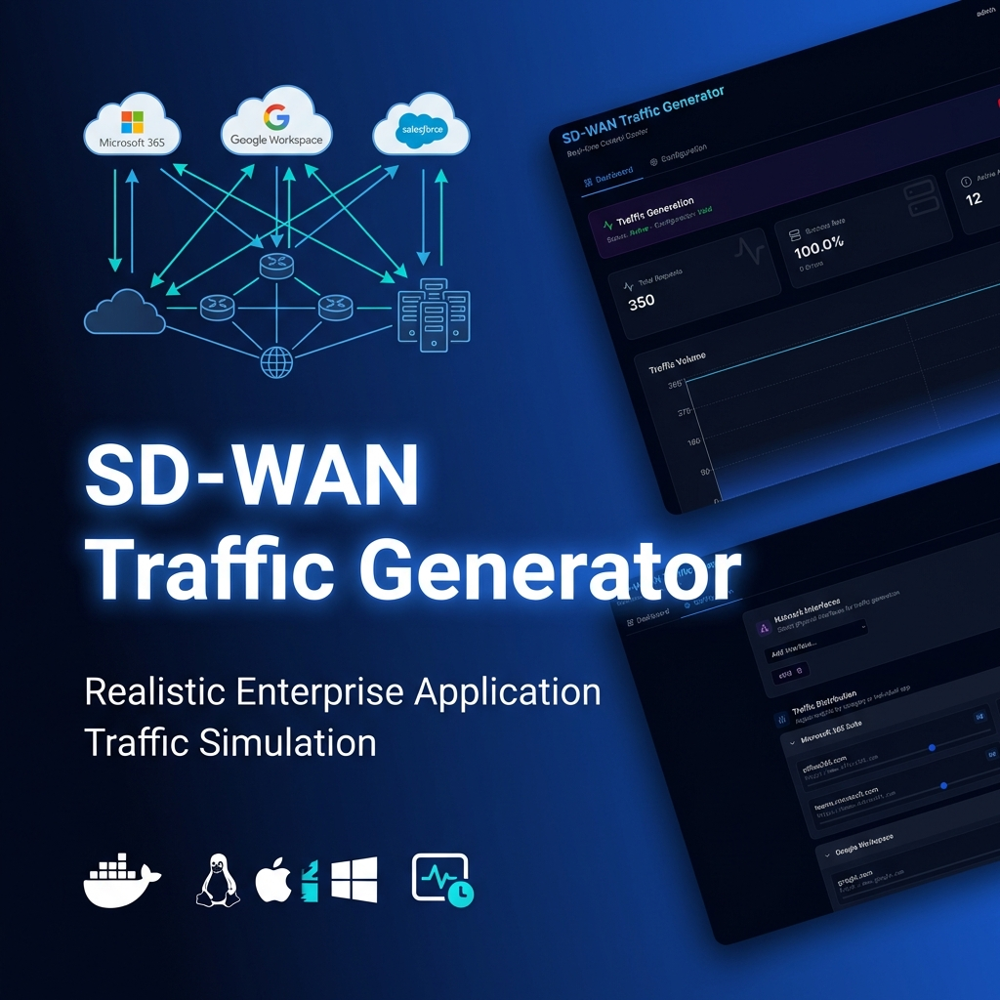

# SD-WAN Traffic Generator Web

[](https://hub.docker.com/r/jsuzanne/sdwan-traffic-gen)
[](LICENSE)
[](https://github.com/jsuzanne/sdwan-traffic-generator-web/releases)

A modern web-based SD-WAN traffic generator with real-time monitoring, customizable traffic patterns, and comprehensive security testing. Perfect for testing SD-WAN deployments, network QoS policies, and application performance.



---

## 📑 Table of Contents

- [Features](#-features)
- [Screenshots Gallery](#-screenshots-gallery)
- [Platform Support](#️-platform-support)
- [Prerequisites](#-prerequisites)
- [Quick Start](#-quick-start)
- [Verify Installation](#-verify-installation)
- [What Happens on First Start?](#-what-happens-on-first-start)
- [Usage](#-usage)
- [Configuration](#-configuration)
- [Useful Commands](#️-useful-commands)
- [Architecture](#️-architecture)
- [Troubleshooting](#-troubleshooting)
- [Security](#-security)
- [Key Concepts](#-key-concepts)
- [Docker Images](#-docker-images)
- [Documentation](#-documentation)
- [Use Cases](#-use-cases)
- [Contributing](#-contributing)
- [Roadmap](#-roadmap)
- [License](#-license)
- [Support](#-support)

---

## ✨ Features

### 🚀 Traffic Generation
- **67 Pre-configured Applications** - Popular SaaS apps (Google, Microsoft 365, Salesforce, Zoom, etc.).
- **Realistic Traffic Patterns** - Authentic HTTP requests with proper headers, User-Agents, and Referers
- **Real-time Dashboard** - Live traffic visualization, metrics, and status monitoring
- **Weighted Distribution** - Configure application traffic ratios using a visual Group/App percentage system
- **Traffic Rate Control** - Dynamically adjust generation speed from 0.1s to 5s delay via a slider
- **Protocol & IP Flexibility** - Support for explicit `http://` or `https://` and full IP address identification
- **Multi-interface Support** - Bind to specific network interfaces
- **Voice Simulation (RTP)** - Simulate real-time voice calls (G.711, G.729) with Scapy-based packet forging. [Read more](docs/VOICE_SIMULATION.md)
- **IoT Simulation** - Simulate a variety of IoT devices (Cameras, Sensors) with Scapy-based DHCP and ARP support for "Real-on-the-Wire" physical network presence.  [Read more](docs/IOT_SIMULATION.md)
- **Convergence Lab (Performance)** - High-precision UDP failover monitoring (up to 100 PPS) to measure SD-WAN tunnel transition times. [Read more](docs/CONVERGENCE_LAB.md)
- **Smart Networking** - Auto-detection of default gateways and interfaces (enp2s0, eth0) for a "Zero-Config" experience on physical Linux boxes. [Read more](docs/SMART_NETWORKING.md)
- **VyOS Control ** - Orchestrate network events and perturbations (latency, loss, rate-limiting) on VyOS routers via Vyos API. [Read more](docs/VYOS_CONTROL.md)
- **Target Site Mode** - Standalone container acting as a branch/hub target with HTTP, Voice, and Bandwidth services. [Read more](docs/TARGET_CAPABILITIES.md)

### 🛡️ Security Testing (v1.1.0)
- **URL Filtering Tests** - Validate 66 different URL categories (malware, phishing, gambling, adult content, etc.)
- **DNS Security Tests** - Test DNS security policies with 24 domains (malware, phishing, DGA, etc.)
- **Threat Prevention** - EICAR file download testing for IPS validation
- **Scheduled Testing** - Automated security tests at configurable intervals
- **Test Results History** - Persistent logging with search, filtering, and export

### 📊 Monitoring & Analytics
- **Real-time Logs** - Live log streaming with WebSocket updates
- **Statistics Dashboard** - Success/failure rates, latency metrics, bandwidth tracking
- **Persistent Logging** - JSONL storage with 7-day retention and auto-rotation
- **Resource Monitoring** - Real-time CPU and RAM usage tracking directly in the dashboard
- **Search & Filter** - Find specific tests quickly with powerful search
- **Export Capabilities** - Download results in JSON, CSV, or JSONL format

### 🔧 Zero-Config Deployment
- **Auto-detection** - Automatically detects network interfaces on first start
- **Auto-generated Config** - Creates applications.txt with 67 apps automatically
- **One-liner Install** - Ready in 30 seconds with single command (Linux/macOS). Supports **Dashboard** or **Target Site** modes.
- **Docker-based** - Pre-built multi-platform images (AMD64 + ARM64).
- **One-Click Upgrade (Beta)** - Built-in maintenance UI to pull latest images and restart services with a single click.

### 🔒 Production Ready
- **JWT Authentication** - Secure login with token-based auth
- **Log Rotation** - Automatic cleanup with configurable retention
- **Health Monitoring** - Built-in healthchecks and dependency management
- **Resource Limits** - Optional CPU and memory constraints

---

## 🆕 What's New in v1.2.1

Recent improvements and features added to the SD-WAN Traffic Generator:

### v1.2.1-patch.15 (Latest)
- **System Maintenance**: Fixed version detection using GitHub Releases API for correct ordering

### v1.2.1-patch.14
- **CRITICAL FIX**: Restored IoT emulator directory accidentally deleted in patch.9

### v1.2.1-patch.13
- **IoT Manager**: Added safety check to gracefully handle missing Python emulator

### v1.2.1-patch.12
- **Docker Build Fix**: Removed stale /iot directory references causing build failures

### v1.2.1-patch.11
- **VyOS Control**: New mission sequences default to "Manual Trigger Only" for better workflow

### v1.2.1-patch.10
- **VyOS Controller**: Made discovery timeout configurable (default 30s) and fixed error message
- **Web UI Container**: Added vim-tiny editor for easier debugging

### v1.2.1-patch.9
- **Documentation**: Added table of contents, organized screenshot gallery (9 categories), What's New section, and reorganized documentation by user journey

### v1.2.1-patch.8
- **Voice Dashboard UI**: Renamed "Diagnostic Monitoring" to "Call Monitoring" for better clarity
- **Configuration**: Simplified button labels ("Save" instead of "Commit Configuration")

### v1.2.1-patch.7
- **Build Fix**: Resolved Docker build failure in ConnectivityPerformance component

### v1.2.1-patch.6
- **Security Dashboard**: Added "Allowed" statistics column to DNS Protection card
- **Connectivity Performance**: Fixed flaky endpoints filtering to respect "Show Deleted" toggle

### v1.2.1-patch.5
- **Synthetic Probes**: Full JSON configuration export/import in Configuration tab
- **Voice MOS Score**: Real-time Average MOS Score display in Voice Dashboard
- **Green Favicon**: New green digital globe favicon for Target App

### v1.2.1-patch.4
- **Security Configuration**: Fixed EICAR config persistence issue
- **Help Integration**: Added documentation link to Security tab

[View full changelog →](CHANGELOG.md)

---

## 📸 Screenshots Gallery

Explore the application interface organized by feature area. Each category contains detailed screenshots showcasing the functionality.

### 🏠 Main Dashboard
Real-time monitoring, traffic control, and system health overview.


**[View all Main Dashboard screenshots →](docs/screenshots/00%20-%20Main%20Dashboard)** (2 images)

---

### ⚙️ Configuration
Network interfaces, traffic distribution, synthetic probes, and application management.


**[View all Configuration screenshots →](docs/screenshots/01%20-%20Configuration)** (2 images)

---

### 📊 Statistics
Traffic volume charts, success rates, and performance metrics.


**[View all Statistics screenshots →](docs/screenshots/02%20-%20Statistics)** (1 image)

---

### 🛡️ Security Testing
URL filtering, DNS security, threat prevention validation, and test results history.


**[View all Security screenshots →](docs/screenshots/03%20-%20security)** (7 images)

---

### 🎯 Performance Monitoring
Connectivity performance, synthetic probes, and endpoint health tracking.


**[View all Performance screenshots →](docs/screenshots/04%20-%20Performance)** (5 images)

---

### 🔌 IoT Simulation
Layer-2/3 device simulation with DHCP and ARP support.


**[View all IoT screenshots →](docs/screenshots/05%20-%20IOT)** (4 images)

---

### 🎙️ Voice Simulation
RTP packet generation, QoS analytics, and MOS scoring.


**[View all Voice screenshots →](docs/screenshots/06%20-%20Voice)** (3 images)

---

### 🔄 Failover Lab
High-precision UDP failover monitoring and convergence testing.


**[View all Failover screenshots →](docs/screenshots/07%20-%20Failover)** (3 images)

---

### 🌐 VyOS Control
Network impairment orchestration (latency, loss, rate-limiting) on VyOS routers.


**[View all VyOS Control screenshots →](docs/screenshots/08%20-%20Vyos%20Control)** (5 images)

---

## 🖥️ Platform Support

This application runs on:

- **🐧 Linux** - Docker Engine (Ubuntu, Debian, CentOS, etc.)
- **🍎 macOS** - Docker Desktop for Mac (macOS 11+)
- **🪟 Windows** - Docker Desktop with WSL 2 (Windows 10/11)

> **Windows Users:** The one-liner installation script is not supported in PowerShell.  
> Please follow the **[Windows Installation Guide](docs/WINDOWS_INSTALL.md)** for step-by-step instructions.

---

## 📋 Prerequisites

### Docker Installation Required

This application runs in Docker containers. You **must** have Docker installed and running before installation.

#### 🐳 macOS
- **Install Docker Desktop for Mac**
  - Download from: https://www.docker.com/products/docker-desktop/
  - Requires macOS 11 or later
  - **Important:** Launch Docker Desktop and wait until it's running (🐳 icon in menu bar)

#### 🪟 Windows
- **Install Docker Desktop for Windows with WSL 2**
  - **Complete guide:** [Windows Installation Guide](docs/WINDOWS_INSTALL.md)
  - Requires Windows 10/11 64-bit
  - **Important:** WSL 2 must be enabled and Docker Desktop must be running

#### 🐧 Linux (Ubuntu/Debian)
- **Install Docker Engine**
  - Follow official guide: https://docs.docker.com/engine/install/ubuntu/
  - Or quick install:
    ```bash
    curl -fsSL https://get.docker.com -o get-docker.sh
    sudo sh get-docker.sh
    sudo usermod -aG docker $USER
    # Logout and login again
    ```

#### ✅ Verify Docker Installation

```bash
# Check Docker is running
docker --version
docker ps

# Expected output:
# Docker version 24.x.x or later
# CONTAINER ID   IMAGE     COMMAND   CREATED   STATUS   PORTS   NAMES
```

---

## 🚀 Quick Start

### Option 1: One-Liner Install (Linux/macOS) ⭐

**Requirements:** Docker must be running (see [Prerequisites](#-prerequisites) above)

**Full Dashboard (Default):**
```bash
curl -sSL https://raw.githubusercontent.com/jsuzanne/sdwan-traffic-generator-web/main/install.sh | bash
```

**Target Site Only:**
```bash
curl -sSL https://raw.githubusercontent.com/jsuzanne/sdwan-traffic-generator-web/main/install.sh | bash -s -- --target
```

This will:
- ✅ Check if Docker is installed and running
- ✅ Let you choose between **Full Dashboard** or **Target Site**
- ✅ Download the correct docker-compose.yml
- ✅ Pull pre-built images from Docker Hub
- ✅ Start services automatically
- ✅ Auto-generate configuration

**Access:** http://localhost:8080  
**Credentials:** `admin` / `admin` (change after first login)

> **Note:** This method is not supported on Windows. Windows users should use Option 2 below or follow the [Windows Installation Guide](docs/WINDOWS_INSTALL.md).

---

### Option 2a: Manual Install (Linux)

**Full Dashboard (Interactive):**
```bash
# Download docker-compose.yml
curl -sSL -o docker-compose.yml https://raw.githubusercontent.com/jsuzanne/sdwan-traffic-generator-web/main/docker-compose.host.yml

# Start services
docker compose up -d

# Access dashboard
open http://localhost:8080
```

### Option 2b: Manual Install (Mac in docker bridge mode)
```bash
# Download docker-compose.yml
curl -sSL -o docker-compose.yml https://raw.githubusercontent.com/jsuzanne/sdwan-traffic-generator-web/main/docker-compose.example.yml

# Start services
docker compose up -d

# Access dashboard
open http://localhost:8080
```

**Target Site Only:**
```bash
# Create directory
mkdir -p sdwan-target && cd sdwan-target

# Download target docker-compose.yml
curl -sSL -o docker-compose.yml https://raw.githubusercontent.com/jsuzanne/sdwan-traffic-generator-web/main/docker-compose.target.yml

# Start services
docker compose up -d

# Verify (Echo responder on port 6200/UDP)
docker compose ps
```

**Windows (PowerShell):**
```powershell
# Create directory
mkdir C:\sdwan-traffic-gen
cd C:\sdwan-traffic-gen

# Download docker-compose.yml (note: curl.exe, not curl)
curl.exe -L https://raw.githubusercontent.com/jsuzanne/sdwan-traffic-generator-web/main/docker-compose.example.yml -o docker-compose.yml

# Start services
docker compose up -d

# Access dashboard in browser
# http://localhost:8080
```

**Default credentials:** `admin` / `admin`

**For detailed Windows instructions, see [Windows Installation Guide](docs/WINDOWS_INSTALL.md)**

---

## 📊 Verify Installation

```bash
# go to directory
cd sdwan-traffic-gen/

# Check containers status
docker compose ps

# Check logs (should be clean, no [ERROR] messages)
docker compose logs -f

# Check health endpoint
curl http://localhost:8080/api/health
# Expected: {"status":"healthy","version":"1.1.0-patch.7"}

# Check auto-generated config
ls -la config/
cat config/interfaces.txt  # Your auto-detected interface
cat config/applications.txt | head -5  # 67 applications
```

**Expected:** No `[ERROR]` messages in logs ✅

---

## 🎯 What Happens on First Start?

The system auto-generates everything you need:

1. **`config/applications.txt`** - 67 popular SaaS applications (Google, Microsoft 365, Salesforce, etc.)
2. **`config/interfaces.txt`** - Auto-detected network interface (eth0, en0, ens4, etc.)
3. **`config/users.json`** - Default admin user with bcrypt-hashed password

**No manual configuration needed!** 🎉

Simply start the containers and access the dashboard at http://localhost:8080

---

## 📖 Usage

### Managing Traffic Generation

1. **Login** to the web dashboard at `http://localhost:8080`
2. **Dashboard Tab**: View real-time statistics and control traffic generation
3. **Configuration Tab**: 
   - Add network interfaces (e.g., `eth0`, `wlan0`)
   - Adjust traffic distribution percentages for different application categories
   - Use explicit `http://` or `https://` prefixes for internal or specific servers
4. **Logs Tab**: View real-time traffic logs and statistics
5. **Security Tab**: Run URL filtering, DNS security, and threat prevention tests
6. **Start/Stop**: Use the toggle button on the dashboard

### Running Security Tests

Navigate to the **Security** tab to:
- Test URL categories (malware, phishing, gambling, etc.)
- Validate DNS security policies
- Test IPS/threat prevention with EICAR downloads
- Schedule automated tests
- View and export test results

---

## 🔧 Configuration

### Change Port

```yaml
# docker-compose.yml
ports:
  - "8081:8080"  # Use port 8081 instead of 8080
```

Or use environment variables:
```bash
echo "WEB_UI_PORT=8081" > .env
```

### Add Custom Connectivity Tests

```yaml
# docker-compose.yml - web-ui environment section
environment:
  # HTTP/HTTPS endpoints
  - CONNECTIVITY_HTTP_1=Production-App:https://myapp.company.com
  - CONNECTIVITY_HTTP_2=Staging-App:https://staging.company.com

  # PING tests (ICMP)
  - CONNECTIVITY_PING_1=HQ-Gateway:10.0.0.1
  - CONNECTIVITY_PING_2=Branch-Gateway:192.168.100.1

  # TCP port checks
  - CONNECTIVITY_TCP_1=SSH-Bastion:10.0.0.100:22
  - CONNECTIVITY_TCP_2=Database:10.0.0.50:3306
```

### Adjust Traffic Frequency

```yaml
# docker-compose.yml - traffic-gen environment section
environment:
  - SLEEP_BETWEEN_REQUESTS=2  # 1 request every 2 seconds (0.5 req/sec)
```

### Change Log Retention

```yaml
# docker-compose.yml - web-ui environment section
environment:
  - LOG_RETENTION_DAYS=30  # Keep logs for 30 days
  - LOG_MAX_SIZE_MB=500    # Max 500 MB per log file
```

---

## 🛠️ Useful Commands

```bash
# View logs in real-time
docker compose logs -f

# View logs for a specific service
docker compose logs -f web-ui
docker compose logs -f traffic-gen

# Restart services
docker compose restart

# Stop services
docker compose stop

# Stop and remove containers
docker compose down

# Rebuild after code changes
docker compose up -d --build

# Check resource usage
docker stats sdwan-web-ui sdwan-traffic-gen

# Access container shell
docker compose exec web-ui sh
docker compose exec traffic-gen sh

# Export logs
docker compose logs --no-color > logs-export.txt
```

---

## 🏗️ Architecture

```
┌─────────────────────────────────────────────────────────────┐
│                     User Browser                            │
│                  http://localhost:8080                      │
└────────────────────────┬────────────────────────────────────┘
                         │
                         ▼
        ┌────────────────────────────────────────┐
        │       Web Dashboard (React)            │
        │   - Authentication (JWT)               │
        │   - Real-time logs                     │
        │   - Statistics & monitoring            │
        │   - Configuration UI                   │
        │   - Security testing                   │
        │   Port: 8080                           │
        └────────────┬───────────────────────────┘
                     │
                     │ API Calls
                     ▼
        ┌────────────────────────────────────────┐
        │    Backend API (Node.js/Express)       │
        │   - Config management                  │
        │   - Log aggregation                    │
        │   - Connectivity testing               │
        │   - Stats calculation                  │
        │   - Security test execution            │
        └────────────┬───────────────────────────┘
                     │
                     │ Shared Volumes
                     ▼
        ┌────────────────────────────────────────┐
        │   Traffic Generator (Python)           │
        │   - HTTP/HTTPS requests                │
        │   - Multi-threading                    │
        │   - Realistic headers                  │
        │   - Network interface binding          │
        └────────────┬───────────────────────────┘
                     │
                     │ Network Traffic
                     ▼
        ┌────────────────────────────────────────┐
        │         Internet / SD-WAN              │
        │   (Google, Microsoft 365, etc.)        │
        └────────────────────────────────────────┘

Shared Volumes:
  • config/  - Configuration files (applications.txt, interfaces.txt)
  • logs/    - Traffic logs, test results, statistics
```

---

## 🐛 Troubleshooting

### Docker Not Running

**Error:** `Cannot connect to the Docker daemon`

**Solution:**
- **macOS/Windows:** Launch Docker Desktop and wait until the 🐳 icon appears
- **Linux:** `sudo systemctl start docker`
- **Windows specific issues:** See [Windows Installation Guide](docs/WINDOWS_INSTALL.md#troubleshooting)

### Docker Pull Timeout

**Error:** `context deadline exceeded`

**Solution:**
```bash
# Retry the pull
docker compose pull

# Or manually pull images
docker pull jsuzanne/sdwan-web-ui:stable
docker pull jsuzanne/sdwan-traffic-gen:stable
```

### Port 8080 already in use

```yaml
# Change port in docker-compose.yml
ports:
  - "8081:8080"
```

Or:
```bash
echo "WEB_UI_PORT=8081" > .env
docker compose up -d
```

### Cannot connect to dashboard

```bash
# Check containers are running
docker compose ps

# Check logs for errors
docker compose logs web-ui
docker compose logs traffic-gen

# Check firewall (Linux)
sudo ufw allow 8080/tcp
```

### Traffic not generating

```bash
# Check network interface configuration
docker compose exec traffic-gen cat /opt/sdwan-traffic-gen/config/interfaces.txt

# Should show your interface (eth0, en0, ens4, etc.)
# If incorrect, edit config/interfaces.txt and restart
docker compose restart
```

### [ERROR] Configuration file not found

This error should **NOT** appear in v1.1.0-patch.7 or later. If you see it:

```bash
# Update to latest version
docker compose pull
docker compose down
docker compose up -d
```

### Logs filling up disk space

```yaml
# Reduce retention in docker-compose.yml
environment:
  - LOG_RETENTION_DAYS=3
  - LOG_MAX_SIZE_MB=50
```

### No Traffic Being Generated

1. Check that network interfaces are configured in the Configuration tab
2. Verify traffic generation is started (green "Active" status on dashboard)
3. Check logs: `docker compose logs -f traffic-gen`

---

## 🔒 Security

### Production Deployment Checklist

- [ ] Change default admin password (Dashboard → Settings)
- [ ] Set strong JWT_SECRET in docker-compose.yml
- [ ] Use HTTPS with a reverse proxy (nginx, Traefik, Caddy)
- [ ] Restrict access with firewall rules
- [ ] Enable Docker resource limits
- [ ] Review and customize application list
- [ ] Set appropriate log retention policies

### JWT Secret

```yaml
# docker-compose.yml - web-ui environment
environment:
  - JWT_SECRET=your-super-secure-random-string-here
```

Generate a secure secret:
```bash
openssl rand -base64 32
```

---

## 🔑 Key Concepts

### Traffic Generator vs Security Tests

The SD-WAN Traffic Generator has **two separate systems**:

| Feature | Traffic Generator | Security Tests |
|---------|------------------|----------------|
| **Purpose** | Simulate user traffic | Test security policies |
| **Source** | `config/applications.txt` | Hardcoded test URLs |
| **Execution** | Continuous background | On-demand or scheduled |
| **Logs** | `/var/log/sdwan-traffic-gen/traffic.log` | `test-results.jsonl` |
| **Examples** | google.com, office365.com | urlfiltering.paloaltonetworks.com |

**Traffic Generator** creates realistic application traffic for SD-WAN demos.  
**Security Tests** validate URL filtering, DNS security, and threat prevention policies.

---

## 📦 Docker Images

Pre-built images are available on Docker Hub:

- **Web UI:** [`jsuzanne/sdwan-web-ui:stable`](https://hub.docker.com/r/jsuzanne/sdwan-web-ui)
- **Traffic Generator:** [`jsuzanne/sdwan-traffic-gen:stable`](https://hub.docker.com/r/jsuzanne/sdwan-traffic-gen)
- **Voice Generator:** [`jsuzanne/sdwan-voice-gen:stable`](https://hub.docker.com/r/jsuzanne/sdwan-voice-gen)
- **Voice Echo:** [`jsuzanne/sdwan-voice-echo:stable`](https://hub.docker.com/r/jsuzanne/sdwan-voice-echo)

Images are automatically built for **AMD64** and **ARM64** architectures.

---

## 📚 Documentation

Comprehensive guides organized by your journey with the SD-WAN Traffic Generator.

### 🚀 Getting Started
- **[Installation Guide](INSTALLATION.md)** - Complete setup instructions with troubleshooting
- **[Windows Installation Guide](docs/WINDOWS_INSTALL.md)** - Step-by-step guide for Windows 10/11
- **[Quick Start Guide](docs/QUICK_START.md)** - Get up and running in 5 minutes
- **[Configuration Guide](docs/CONFIGURATION.md)** - Advanced configuration options

### 🎯 Core Features
- **[Traffic Generator Guide](docs/TRAFFIC_GENERATOR.md)** - Configure applications.txt and traffic weights
- **[Security Testing Guide](docs/SECURITY_TESTING.md)** - Comprehensive security testing documentation
  - [Security Quick Reference](docs/SECURITY_QUICK_REFERENCE.md) - Quick reference for security tests
  - [Security FAQ](docs/SECURITY_TESTING_FAQ.md) - Frequently asked questions
- **[Connectivity Endpoints](docs/CONNECTIVITY_ENDPOINTS.md)** - System health monitoring and synthetic probes

### 🔬 Advanced Features
- **[Voice Simulation Guide](docs/VOICE_SIMULATION.md)** - RTP packet forging and MOS scoring theory
- **[IoT Simulation Guide](docs/IOT_SIMULATION.md)** - Layer-2/3 device simulation and Scapy networking
- **[Convergence Lab Guide](docs/CONVERGENCE_LAB.md)** - High-precision failover & RX/TX loss theory
- **[VyOS Control Guide](docs/VYOS_CONTROL.md)** - Orchestrating SD-WAN impairments on VyOS nodes
- **[Smart Networking Guide](docs/SMART_NETWORKING.md)** - Host Mode and auto-detection architecture
- **[Target Capabilities](docs/TARGET_CAPABILITIES.md)** - Standalone target site deployment

### 🔧 Operations & Maintenance
- **[Persistent Logging](docs/PERSISTENT_LOGGING.md)** - Test results storage, search, and export
- **[Maintenance & Update Guide](docs/MAINTENANCE.md)** - How to update via UI, script, or manually
- **[Remote Access Guide](docs/REMOTE_ACCESS.md)** - Guidelines for Tailscale, Cloudflare Tunnels, and Reverse Proxies
- **[Troubleshooting Guide](docs/TROUBLESHOOTING.md)** - Common issues and solutions

### 📖 Technical Reference
- **[MCP Server](docs/MCP_SERVER.md)** - Model Context Protocol integration
- **[Architecture Overview](docs/ARCHITECTURE_OVERVIEW.md)** - System architecture and design
- **[Technical Diagram](docs/TECHNICAL_DIAGRAM.md)** - Visual architecture diagrams

---

## 🎯 Use Cases

- **SD-WAN Testing** - Validate traffic routing, QoS policies, and failover scenarios
- **Security Policy Testing** - Test URL filtering, DNS security, and threat prevention
- **Network Performance** - Measure latency, bandwidth, and reliability
- **Firewall Validation** - Verify firewall rules and application awareness
- **Load Testing** - Generate sustained traffic for capacity planning
- **Demo & Training** - Educational tool for network engineers and sales demonstrations
- **Compliance** - Verify network policies and application access controls

---

## 🤝 Contributing

Contributions are welcome! Please feel free to submit a Pull Request.

### Development Setup

```bash
# Clone repository
git clone https://github.com/jsuzanne/sdwan-traffic-generator-web.git
cd sdwan-traffic-generator-web

# Install web dashboard dependencies
cd web-dashboard
npm install

# Run in development mode
npm run dev

# Build for production
npm run build
```

---

## 📈 Roadmap

- [ ] Multi-region deployment support
- [ ] Advanced traffic patterns (burst, gradual ramp-up)
- [ ] Custom protocol support (DNS, FTP, SMTP, etc.)
- [ ] Grafana/Prometheus integration
- [ ] API for programmatic control
- [ ] Traffic replay from PCAP files
- [ ] Cloud provider integrations (AWS, Azure, GCP)
- [ ] WebRTC and video streaming simulation
- [ ] Custom security test categories
- [ ] PowerShell installation script for Windows

---

## Disclaimer

This is a personal, community-driven project maintained in my own name.
It is **not** an official Palo Alto Networks product, feature, or tool, and it is
not supported by Palo Alto Networks in any way.

All opinions, configurations, and examples in this repository are my own and do
not represent the views of my employer. Use this software at your own risk and
always validate behavior in a lab environment before using it in production.

This project is provided "as is", without any warranty of any kind, express or
implied, including but not limited to fitness for a particular purpose or
non-infringement.

---

## 📝 License

This project is licensed under the MIT License - see the [LICENSE](LICENSE) file for details.

---

## 🆘 Support

- **Documentation:** [INSTALLATION.md](INSTALLATION.md) | [Windows Guide](docs/WINDOWS_INSTALL.md)
- **Issues:** [GitHub Issues](https://github.com/jsuzanne/sdwan-traffic-generator-web/issues)
- **Discussions:** [GitHub Discussions](https://github.com/jsuzanne/sdwan-traffic-generator-web/discussions)

---

## 🙏 Acknowledgments

- Built with [React](https://reactjs.org/), [TypeScript](https://www.typescriptlang.org/), and [Vite](https://vitejs.dev/)
- UI components from [shadcn/ui](https://ui.shadcn.com/)
- Icons from [Lucide](https://lucide.dev/)
- Traffic generation powered by Python [requests](https://requests.readthedocs.io/)

---

**Made with ❤️ for SD-WAN testing and demonstrations**

For detailed installation instructions, see [INSTALLATION.md](INSTALLATION.md)  
For Windows-specific setup, see [Windows Installation Guide](docs/WINDOWS_INSTALL.md)
