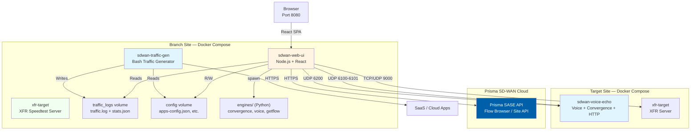
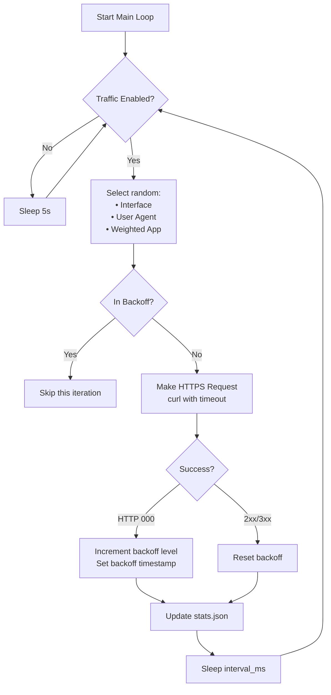
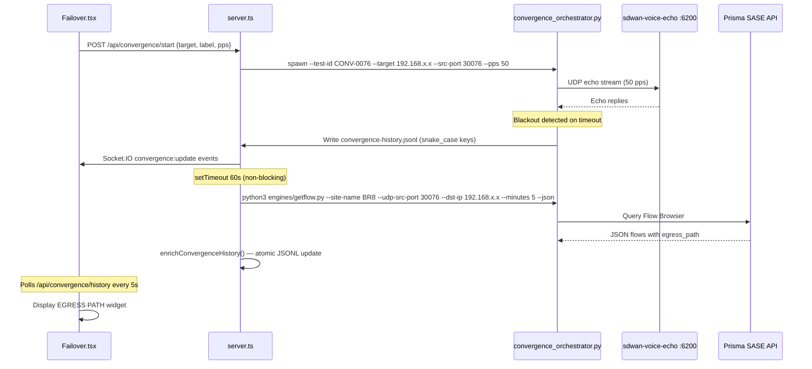

# SD-WAN Traffic Generator — Technical Specification

**Version**: `v1.2.1-patch.106`
**Last Updated**: February 2026

---

## Executive Summary

The **SD-WAN Traffic Generator** is a realistic enterprise network simulation platform designed for SD-WAN testing, demonstrations, and lab validation. It spans three core pillars:

1. **Traffic Simulation** — Weighted HTTP/HTTPS requests to 60+ enterprise SaaS applications (Microsoft 365, Google Workspace, Salesforce, etc.)
2. **Network Impairment & Control** — VyOS router orchestration with CYCLE and STEP-BY-STEP sequence modes for programmatic failover scenarios
3. **Measurement & Validation** — Convergence testing (failover timing, egress path enrichment), Voice MOS scoring, XFR throughput, connectivity probing, and security policy validation

The system integrates natively with **Prisma SD-WAN (CloudGenix)** for Zero-Config site detection, smart target discovery, and automatic egress path enrichment via the Flow Browser API.

---

## Key Capabilities

| Capability | Description |
|---|---|
| **Realistic Traffic Simulation** | HTTP/HTTPS to 60+ SaaS apps with weighted distribution and exponential backoff |
| **Convergence Lab** | Sub-millisecond UDP echo testing with full failover timeline, history JSONL, and Prisma egress path enrichment |
| **VyOS Control** | SSH-based orchestration of VyOS routers with CYCLE and STEP-BY-STEP sequence modes |
| **XFR Speedtest** | High-performance throughput testing (TCP/UDP/QUIC) with deterministic ports and quick targets |
| **Voice/VoIP Testing** | RTP packet generation with MOS score (R-value) and codec profile simulation |
| **Security Testing** | URL filtering, DNS sinkhole detection, EICAR threat tests, and EDL management |
| **Connectivity Performance** | Multi-probe latency monitoring, TCP handshake timing, and Docker stats |
| **IoT Simulation** | Scapy-powered L2/L3 simulation (ARP, DHCP, mDNS, SSDP) for 20+ device types |
| **Prisma SD-WAN Integration** | Auto site detection, DC target discovery, flow browser egress path enrichment |
| **Web Dashboard** | React 19 SPA with real-time Socket.IO events, dark/light themes, JWT auth |

---

## System Architecture

### High-Level Topology



### Container Architecture

#### 1. Traffic Generator (`sdwan-traffic-gen`)
- **Base Image**: `debian:bookworm-slim`
- **Entry Point**: `traffic-generator.sh`
- **Language**: Bash
- **Purpose**: Generates continuous weighted HTTPS requests to SaaS applications

#### 2. Web Dashboard (`sdwan-web-ui`)
- **Base Image**: `node:20-alpine` (multi-stage build)
- **Backend**: Express.js (TypeScript) on port 8080
- **Frontend**: React 19 + Vite bundled into `dist/`
- **Python Engines**: Spawned as child processes from `server.ts`
- **Real-time**: Socket.IO for live push events
- **Purpose**: Unified control plane, measurement engine, and UI

#### 3. XFR Target (`xfr-target`)
- **Image**: `jsuzanne/xfr-target:latest`
- **Network**: Host mode (avoids NAT overhead)
- **Purpose**: XFR throughput test server (replaces iperf3)
- **Default Port**: 9000 (TCP/UDP/QUIC)

#### Target Site: Voice Echo (`sdwan-voice-echo`)
- **Image**: `jsuzanne/sdwan-voice-echo:latest`
- **Purpose**: Multi-service echo server deployed at remote branches or DCs
- **Services**: Voice RTP echo (6100-6101), Convergence UDP echo (6200), iperf3 (5201), HTTP app simulation (8082)

---

## Shared Resources

### Volume: `traffic_logs`
- **Container Path**: `/var/log/sdwan-traffic-gen`
- `traffic.log` — detailed per-request log with traceids
- `stats.json` — rolling statistics updated every 50 requests

### Volume / Bind Mount: `config/`
- **Container Path**: `/app/config`

| File | Purpose |
|---|---|
| `applications-config.json` | App list with weights, enabled state, and traffic control |
| `vyos-config.json` | VyOS routers, sequences, actions |
| `security-config.json` | Security test history and settings |
| `voice-config.json` | Voice profiles and session settings |
| `convergence-endpoints.json` | Convergence test target definitions |
| `convergence-history.jsonl` | JSONL append-only log of all convergence test results |
| `convergence-counter.json` | Monotonic counter for test ID generation (`CONV-XXXX`) |
| `interfaces.txt` | Physical host interface names (shared by traffic-gen and IoT) |
| `users.json` | JWT auth user database (bcrypt hashed passwords) |

### Volume: `engines/` (read-only bind mount)
- **Container Path**: `/app/engines`
- Python scripts spawned by the Node.js backend as child processes

| Engine | Purpose |
|---|---|
| `convergence_orchestrator.py` | Runs convergence tests, measures failover timing |
| `echo_server.py` | UDP echo server for convergence measurement |
| `voice_orchestrator.py` | RTP packet generation and MOS/R-value calculation |
| `rtp_enhanced.py` | Enhanced RTP with jitter, loss, and latency metrics |
| `getflow.py` | Prisma SD-WAN Flow Browser API integration |
| `http_server.py` | HTTP target simulation for security testing |
| `srt_orchestrator.py` | SRT stream orchestration |

---

## Component Details

### Traffic Generator Engine

**Script**: `traffic-generator.sh` | **Language**: Bash | **~400 LOC**

#### Main Loop



#### Backoff Strategy

Tracked per `interface_application` pair, allowing other paths to continue:

| Error Count | Backoff |
|---|---|
| 1st | 1 minute |
| 2nd | 5 minutes |
| 3rd | 30 minutes |
| 4th | 1 hour |
| 5+ | 3 hours |

---

### Convergence Lab

**Frontend**: `Failover.tsx` | **Engine**: `engines/convergence_orchestrator.py`

The Convergence Lab is designed for precise measurement of SD-WAN failover performance. Each test generates a bidirectional UDP echo stream and measures the exact blackout window during path switching.

#### Test Flow



#### Test ID & Port Convention

- Test ID format: `CONV-XXXX` (monotonic counter, zero-padded)
- UDP source port: `30000 + test_number` (e.g., CONV-0075 → port 30075)
- Allows deterministic flow identification in SD-WAN flow logs

#### History Record (JSONL)

```json
{
  "test_id": "CONV-0076 (DC1)",
  "timestamp": 1740047523000,
  "target": "192.168.203.100",
  "source_port": 30076,
  "pps": 50,
  "duration_s": 17,
  "max_blackout_ms": 109,
  "verdict": "GOOD",
  "tx_loss_pct": 0,
  "rx_loss_pct": 0,
  "avg_latency_ms": 11.35,
  "jitter_ms": 10.37,
  "egress_path": "BR8-INET2 → DC2-INET"
}
```

#### Egress Path Enrichment

After test completion, `runGetflow()` is called with a 60s delay (fire-and-forget):

| Scenario | Behavior |
|---|---|
| No credentials | Skip silently |
| Script not found | `console.warn` + skip |
| No flows returned | JSONL unchanged — UI shows `—` |
| Test < 3 min old, no path yet | UI shows `⏳ fetching...` |
| Path found | Atomic JSONL update + UI shows `BR8-INET2 → DC2-INET` |

#### Debug Logging

Set `DEBUG=true` in environment to enable verbose `[CONV] [DEBUG]` logs via the `dbg()` helper.

---

### VyOS Control

**Frontend**: `Vyos.tsx` | **Backend**: `vyos-manager.ts`

Provides SSH-based orchestration of VyOS network devices for programmatic impairment scenarios.

#### Sequence Execution Modes

| Mode | Behavior |
|---|---|
| **MANUAL** | Single-shot execution, triggered individually |
| **CYCLE** | Automatic time-based cycling (configurable duration minutes) |
| **STEP-BY-STEP** | Manual advance through steps 1→N, wraps back to 1 on last step |

#### Supported Commands

| Command | Effect |
|---|---|
| `interface-down` | Shut the specified interface (simulates link failure) |
| `interface-up` | No-shut the interface (restore link) |
| `set-qos` | Apply TC netem latency/loss/rate impairment |
| `clear-qos` | Remove TC netem rules |
| `deny-traffic` | Add null-route blackhole for an IP/CIDR |
| `allow-traffic` | Remove blackhole route |
| `clear-all-blocks` | Remove all null-routes |
| `show-denied` | List active denied traffic rules |

#### UI Sections (Tabs)

| Tab | Content |
|---|---|
| **Routers** | SSH-reachable router inventory with connectivity tests |
| **Sequences** | CRUD for action sequences with mode selection |
| **History** | Per-action execution history with success/fail status |
| **Timeline** | Visual execution timeline with dot indicators and countdown |
| **Metrics** | Run counts, success rate, active sequences |

---

### XFR Speedtest

**Frontend**: `Speedtest.tsx` | **Engine**: `xfr-target` container

High-performance throughput testing with real-time telemetry:

| Feature | Detail |
|---|---|
| **Protocols** | TCP, UDP, QUIC |
| **Directions** | Upload, Download, Bidirectional |
| **Bitrate** | Configurable target (e.g., `200M`) or `0` for max |
| **Streams** | 1–8 parallel streams |
| **Source Port** | `40000 + sequence_id` for UDP/QUIC (deterministic) |
| **Quick Targets** | Pre-configured pill shortcuts via `XFR_QUICK_TARGETS` env var |
| **Real-time Graph** | Live throughput (Mbps), RTT (ms), Packet Loss (%) |

---

### Voice & VoIP Testing

**Frontend**: `Voice.tsx` | **Engine**: `engines/voice_orchestrator.py` + `engines/rtp_enhanced.py`

Simulates G.711/G.729/Opus RTP streams to measure VoIP quality:

| Metric | Description |
|---|---|
| **MOS Score** | Mean Opinion Score (1–5), derived from R-value |
| **R-Value** | ITU-T E-model calculation |
| **Jitter** | Inter-packet arrival time variance (ms) |
| **Packet Loss** | Percentage of dropped packets |
| **Latency** | Round-trip time per packet |

Codec profiles define payload size and interval for realistic simulation.

---

### Security Testing

**Frontend**: `Security.tsx`

Four categories of security validation:

#### 1. URL Filtering
- Tests HTTP/HTTPS access to categorized URLs
- Detects blocked vs allowed by NGFW/SD-WAN
- Supports batch mode and custom URL lists

#### 2. DNS Security
- Queries DNS for known malicious domains
- Detects sinkhole responses vs NXDOMAIN vs resolved
- Batch testing with parallel resolution

#### 3. Threat Prevention (EICAR)
- Downloads EICAR test file from configured target
- Validates block by Threat Prevention / IPS engine

#### 4. EDL Management
- Sync and test External Dynamic Lists
- Configurable EDL URL and refresh interval

---

### Connectivity Performance

**Frontend**: `ConnectivityPerformance.tsx`

Multi-dimensional network quality monitoring from the branch:

| Probe Type | What It Measures |
|---|---|
| **ICMP Latency** | RTT to configured targets |
| **TCP Handshake** | SYN→SYN-ACK→ACK timing to TCP services |
| **HTTP Response** | Full request time to HTTP endpoints |
| **iperf3 Client** | Bandwidth measurement via embedded client |
| **Docker Stats** | Container CPU/memory/network counters |
| **Public IP** | Detected egress IP address |
| **Active Probes** | Auto-registered Prisma SD-WAN probe status |

---

### IoT Simulation

**Frontend**: `Iot.tsx` | **Engine**: Scapy Python (spawned)

Layer 2/3 device simulation using raw sockets:

| Category | Example Devices |
|---|---|
| Smart Home | Philips Hue, Sonos, Amazon Echo, Nest |
| Industrial | PLC, Smart Meter, HVAC Controller |
| Office | Cisco IP Phone, Poly Headset, Security Camera, Printer |

Traffic patterns generated:
- **Discovery**: mDNS, SSDP, ARP announcements
- **Control**: TCP/UDP telemetry to cloud endpoints
- **L2 Management**: Full DHCP lifecycle per device MAC

---

### Prisma SD-WAN Integration

**Backend**: `server.ts` + `site-manager.ts` | **Engine**: `engines/getflow.py`

#### Auto-Detection Flow

1. Container starts → `SiteManager.runDetection()` spawns `getflow.py --auto-detect`
2. Detected site name cached in `config/site-info.json`
3. Site badge rendered in UI header
4. Convergence test targets populated from `--list-dc-lan-interfaces`

#### Credentials (`.env` / `docker-compose.yml`)

```bash
PRISMA_SDWAN_CLIENT_ID="app@123456.iam.panserviceaccount.com"
PRISMA_SDWAN_CLIENT_SECRET="your-secret"
PRISMA_SDWAN_TSG_ID="1234567890"
PRISMA_SDWAN_REGION="de"   # de | us | uk
DEBUG=true                 # Enable verbose [CONV] [DEBUG] logs
```

#### Integration Points

| Feature | How Prisma API is Used |
|---|---|
| Site badge in header | `--auto-detect` matches container IP to ION LAN subnets |
| Convergence target list | `--list-dc-lan-interfaces` returns DC/Hub LAN IPs |
| Egress path enrichment | `--udp-src-port + --dst-ip + --minutes` queries Flow Browser |

---

## Web Dashboard

### Technology Stack

| Layer | Technology |
|---|---|
| Frontend Framework | React 19 + TypeScript |
| Build Tool | Vite |
| Styling | TailwindCSS 4 |
| Charts | Recharts |
| Icons | Lucide React |
| Real-time | Socket.IO |
| Backend | Express.js 5 (TypeScript) |
| Auth | JWT (`jsonwebtoken`) + bcrypt |
| Python Bridge | `child_process.spawn()` |

### Frontend Component Map

| Component | File | Tab |
|---|---|---|
| **App** | `App.tsx` | Main shell, navigation, traffic control |
| **Login** | `Login.tsx` | Authentication form |
| **Config** | `Config.tsx` | App weights, interfaces, import/export |
| **Statistics** | `Statistics.tsx` | Traffic charts, per-app breakdown |
| **Failover** | `Failover.tsx` | Convergence Lab |
| **Vyos** | `Vyos.tsx` | VyOS Control (Routers / Sequences / Timeline) |
| **Speedtest** | `Speedtest.tsx` | XFR throughput testing |
| **Voice** | `Voice.tsx` | VoIP / RTP MOS testing |
| **Security** | `Security.tsx` | URL / DNS / EICAR / EDL testing |
| **ConnectivityPerformance** | `ConnectivityPerformance.tsx` | Multi-probe latency monitoring |
| **Iot** | `Iot.tsx` | IoT device simulation |
| **System** | `System.tsx` | System info, health, version |
| **SRTAnalytics** | `SRTAnalytics.tsx` | SRT stream analytics |

### Authentication

| Parameter | Value |
|---|---|
| Method | JWT (Bearer token) |
| Expiry | 24 hours |
| Password hashing | bcrypt, 10 salt rounds |
| Default credentials | `admin` / `admin` |
| User storage | `config/users.json` |
| Env override | `JWT_SECRET` |

> [!WARNING]
> Change the default `admin`/`admin` password immediately on first login via Settings → Change Password.

---

## API Reference

### Authentication

| Endpoint | Method | Auth | Description |
|---|---|---|---|
| `/api/auth/login` | POST | ❌ | Login, returns JWT token |
| `/api/auth/change-password` | POST | ✅ | Change own password |
| `/api/auth/users` | POST | ✅ (admin) | Create new user |

### System & Status

| Endpoint | Method | Auth | Description |
|---|---|---|---|
| `/api/version` | GET | ✅ | Current application version |
| `/api/status` | GET | ✅ | Traffic generator heartbeat status |
| `/api/features` | GET | ✅ | Feature flags (Prisma enabled, etc.) |
| `/api/siteinfo` | GET | ✅ | Detected Prisma SD-WAN site info |
| `/api/siteinfo/refresh` | POST | ✅ | Force re-detection of site |
| `/api/system/health` | GET | ✅ | Service health check |
| `/api/system/interfaces` | GET | ✅ | List physical network interfaces |
| `/api/system/default-interface` | GET | ✅ | Auto-detected primary interface |
| `/api/system/auto-detect-interface` | POST | ✅ | Trigger interface auto-detection |
| `/api/admin/system/dashboard-data` | GET | ✅ | Aggregated dashboard metadata |
| `/api/admin/maintenance/version` | GET | ✅ | Version info |
| `/api/admin/maintenance/status` | GET | ✅ | Maintenance status |
| `/api/admin/maintenance/restart` | POST | ✅ | Restart web-ui container |
| `/api/admin/maintenance/upgrade` | POST | ✅ | Pull latest Docker image |
| `/api/admin/config/export` | GET | ✅ | Export full config bundle |
| `/api/admin/config/import` | POST | ✅ | Import config bundle |

### Traffic Control

| Endpoint | Method | Auth | Description |
|---|---|---|---|
| `/api/traffic/status` | GET | ✅ | Traffic enabled/disabled state |
| `/api/traffic/start` | POST | ✅ | Enable traffic generation |
| `/api/traffic/stop` | POST | ✅ | Disable traffic generation |
| `/api/traffic/history` | GET | ✅ | Historical traffic stats |
| `/api/traffic/settings` | POST | ✅ | Update traffic settings |
| `/api/stats` | GET | ✅ | Current stats from `stats.json` |
| `/api/stats` | DELETE | ✅ | Reset statistics |
| `/api/logs` | GET | ✅ | Last 50 lines of `traffic.log` |

### Configuration

| Endpoint | Method | Auth | Description |
|---|---|---|---|
| `/api/config/apps` | GET | ✅ | Categorized app list with weights |
| `/api/config/apps` | POST | ✅ | Update single app weight |
| `/api/config/apps-bulk` | POST | ✅ | Bulk update multiple app weights |
| `/api/config/category` | POST | ✅ | Set all weights in a category |
| `/api/config/interfaces` | GET | ✅ | Current network interfaces |
| `/api/config/interfaces` | POST | ✅ | Save interfaces |
| `/api/config/ui` | GET | ✅ | UI preferences |
| `/api/config/applications/export` | GET | ✅ | Export app config as JSON |
| `/api/config/applications/import` | POST | ✅ | Import app config |

### Convergence Lab

| Endpoint | Method | Auth | Description |
|---|---|---|---|
| `/api/convergence/status` | GET | ✅ | Running test status |
| `/api/convergence/start` | POST | ✅ | Start convergence test `{target, pps, label}` |
| `/api/convergence/stop` | POST | ✅ | Abort running test |
| `/api/convergence/history` | GET | ✅ | Historical test results (JSONL) |
| `/api/convergence/endpoints` | GET | ✅ | Saved target endpoints |
| `/api/convergence/endpoints` | POST | ✅ | Add/update endpoint |
| `/api/convergence/endpoints/:id` | DELETE | ✅ | Remove endpoint |
| `/api/convergence/counter` | DELETE | ✅ | Reset CONV-XXXX counter |

### VyOS Control

| Endpoint | Method | Auth | Description |
|---|---|---|---|
| `/api/vyos/routers` | GET | ✅ | List routers |
| `/api/vyos/routers` | POST | ✅ | Add router |
| `/api/vyos/routers/:id` | POST | ✅ | Update router |
| `/api/vyos/routers/:id` | DELETE | ✅ | Remove router |
| `/api/vyos/routers/discover` | POST | ✅ | Auto-discover interfaces |
| `/api/vyos/routers/test/:id` | POST | ✅ | Test SSH connectivity |
| `/api/vyos/routers/refresh/:id` | POST | ✅ | Refresh interface list |
| `/api/vyos/sequences` | GET | ✅ | List sequences |
| `/api/vyos/sequences` | POST | ✅ | Create/update sequence |
| `/api/vyos/sequences/:id` | DELETE | ✅ | Delete sequence |
| `/api/vyos/sequences/run/:id` | POST | ✅ | Run full sequence |
| `/api/vyos/sequences/step/:id` | POST | ✅ | Execute single step `{stepIndex}` |
| `/api/vyos/sequences/pause/:id` | POST | ✅ | Pause CYCLE sequence |
| `/api/vyos/sequences/resume/:id` | POST | ✅ | Resume CYCLE sequence |
| `/api/vyos/sequences/stop/:id` | POST | ✅ | Stop and reset to step 0 |
| `/api/vyos/history` | GET | ✅ | Execution history |
| `/api/vyos/config/export` | GET | ✅ | Export VyOS config |
| `/api/vyos/config/import` | POST | ✅ | Import VyOS config |
| `/api/vyos/config/reset` | POST | ✅ | Reset to defaults |

### XFR Speedtest

| Endpoint | Method | Auth | Description |
|---|---|---|---|
| `/api/tests/xfr` | GET | ✅ | List XFR test sessions |
| `/api/tests/xfr` | POST | ✅ | Start XFR test `{host, port, protocol, direction, bitrate, duration, streams}` |
| `/api/tests/xfr/:id` | GET | ✅ | Get test result |
| `/api/tests/xfr/:id/stream` | GET | ✅ | SSE stream of live telemetry |

### Voice

| Endpoint | Method | Auth | Description |
|---|---|---|---|
| `/api/voice/status` | GET | ✅ | Active voice session status |
| `/api/voice/stats` | GET | ✅ | MOS / R-value / jitter history |
| `/api/voice/stats` | DELETE | ✅ | Reset voice stats |
| `/api/voice/config` | GET | ✅ | Voice codec profiles |
| `/api/voice/config` | POST | ✅ | Update voice config |
| `/api/voice/control` | POST | ✅ | Start/stop voice session |
| `/api/voice/counter` | DELETE | ✅ | Reset session counter |
| `/api/voice/config/export` | GET | ✅ | Export voice config |
| `/api/voice/config/import` | POST | ✅ | Import voice config |

### Security Testing

| Endpoint | Method | Auth | Description |
|---|---|---|---|
| `/api/security/config` | GET | ✅ | Security test configuration |
| `/api/security/config` | POST | ✅ | Update configuration |
| `/api/security/results` | GET | ✅ | All test results |
| `/api/security/results/:id` | GET | ✅ | Single result |
| `/api/security/results/stats` | GET | ✅ | Aggregate stats |
| `/api/security/results` | DELETE | ✅ | Clear results |
| `/api/security/statistics` | DELETE | ✅ | Reset statistics |
| `/api/security/url-test` | POST | ✅ | Test single URL |
| `/api/security/url-test-batch` | POST | ✅ | Batch URL test |
| `/api/security/dns-test` | POST | ✅ | Test single DNS query |
| `/api/security/dns-test-batch` | POST | ✅ | Batch DNS test |
| `/api/security/threat-test` | POST | ✅ | EICAR threat test |
| `/api/security/edl-config` | GET | ✅ | EDL list configuration |
| `/api/security/edl-config` | POST | ✅ | Update EDL config |
| `/api/security/edl-sync` | POST | ✅ | Sync EDL from URL |
| `/api/security/edl-test` | POST | ✅ | Test EDL entry |
| `/api/security/edl-upload` | POST | ✅ | Upload custom EDL |

### Connectivity Performance

| Endpoint | Method | Auth | Description |
|---|---|---|---|
| `/api/connectivity/test` | GET | ✅ | Run connectivity test |
| `/api/connectivity/results` | GET | ✅ | Stored results |
| `/api/connectivity/stats` | GET | ✅ | Aggregated stats |
| `/api/connectivity/speedtest` | GET | ✅ | Quick throughput test |
| `/api/connectivity/public-ip` | GET | ✅ | Detected egress IP |
| `/api/connectivity/docker-stats` | GET | ✅ | Container resource usage |
| `/api/connectivity/active-probes` | GET | ✅ | Prisma probe status |
| `/api/connectivity/custom` | GET | ✅ | Custom probe targets |
| `/api/connectivity/custom` | POST | ✅ | Add custom probe target |
| `/api/connectivity/custom/export` | GET | ✅ | Export probe config |
| `/api/connectivity/custom/import` | POST | ✅ | Import probe config |
| `/api/connectivity/iperf/server` | GET | ✅ | iperf3 server info |
| `/api/connectivity/iperf/client` | POST | ✅ | Run iperf3 client test |

### IoT Simulation

| Endpoint | Method | Auth | Description |
|---|---|---|---|
| `/api/iot/devices` | GET | ✅ | List simulated devices |
| `/api/iot/devices` | POST | ✅ | Add device |
| `/api/iot/devices/:id` | DELETE | ✅ | Remove device |
| `/api/iot/start/:id` | POST | ✅ | Start device simulation |
| `/api/iot/stop/:id` | POST | ✅ | Stop device simulation |
| `/api/iot/start-batch` | POST | ✅ | Start all devices |
| `/api/iot/stop-batch` | POST | ✅ | Stop all devices |
| `/api/iot/stats` | GET | ✅ | Simulation statistics |
| `/api/iot/config/export` | GET | ✅ | Export IoT config |
| `/api/iot/config/import` | POST | ✅ | Import IoT config |

---

## Docker Configuration

### Production `docker-compose.yml`

```yaml
services:
  traffic-gen:
    image: jsuzanne/sdwan-traffic-gen:latest
    container_name: sdwan-traffic-gen
    network_mode: host
    restart: unless-stopped
    volumes:
      - ./config:/opt/sdwan-traffic-gen/config
      - traffic_logs:/var/log/sdwan-traffic-gen
    environment:
      - SLEEP_BETWEEN_REQUESTS=1

  web-ui:
    image: jsuzanne/sdwan-web-ui:latest
    container_name: sdwan-web-ui
    network_mode: host
    restart: unless-stopped
    volumes:
      - ./config:/app/config
      - traffic_logs:/var/log/sdwan-traffic-gen
      - ./engines:/app/engines:ro
    environment:
      - NODE_ENV=production
      - PORT=8080
      - JWT_SECRET=change-me
      - PRISMA_SDWAN_CLIENT_ID=${PRISMA_SDWAN_CLIENT_ID}
      - PRISMA_SDWAN_CLIENT_SECRET=${PRISMA_SDWAN_CLIENT_SECRET}
      - PRISMA_SDWAN_TSG_ID=${PRISMA_SDWAN_TSG_ID}
      - DEBUG=false
    ports:
      - "8080:8080"

volumes:
  traffic_logs:
```

### Target Site `docker-compose.target.yml`

```yaml
services:
  voice-echo:
    image: jsuzanne/sdwan-voice-echo:latest
    container_name: sdwan-voice-echo
    network_mode: host
    restart: unless-stopped
    environment:
      - DEBUG=True

  xfr-target:
    image: jsuzanne/xfr-target:latest
    container_name: xfr-target
    network_mode: "host"
    restart: unless-stopped
    environment:
      - XFR_PORT=9000
      - XFR_MAX_DURATION=60
      - XFR_RATE_LIMIT=2
      - XFR_ALLOW_CIDR=0.0.0.0/0
```

---

## Project Structure

```
sdwan-traffic-generator/
├── config/                          # Persistent configuration (bind-mounted)
│   ├── applications-config.json     # SaaS app weights and traffic control
│   ├── vyos-config.json             # VyOS routers and sequences
│   ├── security-config.json         # Security test history and settings
│   ├── voice-config.json            # Voice codec profiles
│   ├── convergence-endpoints.json   # Convergence test targets
│   ├── convergence-history.jsonl    # JSONL test result log
│   ├── convergence-counter.json     # Monotonic CONV-XXXX counter
│   ├── interfaces.txt               # Network interface list
│   └── users.json                   # Auth user database
│
├── engines/                         # Python measurement engines
│   ├── convergence_orchestrator.py  # Failover test + blackout timing
│   ├── echo_server.py               # UDP echo (convergence target)
│   ├── voice_orchestrator.py        # RTP generation + MOS scoring
│   ├── rtp_enhanced.py              # Enhanced RTP metrics
│   ├── getflow.py                   # Prisma SD-WAN Flow Browser
│   ├── http_server.py               # HTTP app simulation target
│   └── srt_orchestrator.py          # SRT stream test
│
├── web-dashboard/                   # Web UI source
│   ├── src/
│   │   ├── App.tsx                  # Main dashboard, navigation, traffic
│   │   ├── Failover.tsx             # Convergence Lab
│   │   ├── Vyos.tsx                 # VyOS Control
│   │   ├── Speedtest.tsx            # XFR Throughput Testing
│   │   ├── Voice.tsx                # VoIP / MOS Testing
│   │   ├── Security.tsx             # Security Testing
│   │   ├── ConnectivityPerformance.tsx  # Latency / probes
│   │   ├── Iot.tsx                  # IoT Simulation
│   │   ├── Config.tsx               # App config, weights
│   │   ├── Statistics.tsx           # Traffic charts
│   │   ├── System.tsx               # System info
│   │   ├── Login.tsx                # Authentication
│   │   └── main.tsx                 # React entry point
│   ├── server.ts                    # Express backend (TypeScript)
│   ├── site-manager.ts              # Prisma site detection service
│   ├── vyos-manager.ts              # VyOS SSH orchestration
│   ├── Dockerfile                   # Multi-stage Docker build
│   └── package.json
│
├── traffic-generator.sh             # Core Bash traffic generation script
├── Dockerfile.traffic-gen           # Traffic generator image
├── Dockerfile.voice-echo            # Voice echo server image
├── docker-compose.yml               # Main compose (branch/generator)
├── docker-compose.target.yml        # Target site compose
├── docker-compose.example.yml       # Full annotated example
├── build-and-push.sh                # Multi-platform Docker build script
├── install.sh                       # Interactive install script
├── install_latest.sh                # Always-pull-latest install
└── docs/                            # Extended documentation
    ├── PRISMA-SDWAN_INTEGRATION.md
    ├── TARGET_CAPABILITIES.md
    ├── XFR_TESTING.md
    └── screenshots/
```

---

## Application Categories

60+ enterprise SaaS applications across 15 categories:

| Category | Applications | Weight Range |
|---|---|---|
| **Microsoft 365** | Outlook, Teams, OneDrive, SharePoint | 67–90 |
| **Google Workspace** | Gmail, Drive, Docs, Meet, Calendar | 70–90 |
| **Communication** | Zoom, Slack, Webex, Discord | 40–90 |
| **CRM & Sales** | Salesforce, HubSpot, Dynamics 365 | 41–80 |
| **Project Mgmt** | Monday, Asana, Trello, Jira, Confluence | 55–70 |
| **Cloud Storage** | Dropbox, Box, WeTransfer | 45–75 |
| **Dev & DevOps** | GitHub, GitLab, Bitbucket | 45–75 |
| **Cloud Providers** | Azure Portal, AWS Console, GCP Console | 65–70 |
| **Business Intel** | Tableau, Power BI, Looker | 40–55 |
| **HR & Payroll** | Workday, BambooHR, ADP | 35–55 |
| **Marketing** | LinkedIn, Twitter, Facebook | 45–60 |
| **Design** | Figma, Canva, Adobe CC | 45–55 |
| **Support** | Zendesk, Intercom, Freshdesk | 40–60 |
| **Finance** | QuickBooks, Expensify, Stripe | 40–50 |
| **Security & IT** | Okta, Duo, 1Password | 35–55 |

---

## Deployment

### Quick Start

```bash
# Download install script
curl -fsSL https://raw.githubusercontent.com/jsuzanne/sdwan-traffic-generator-web/main/install_latest.sh | bash

# Or manual
git clone https://github.com/jsuzanne/sdwan-traffic-generator-web.git
cd sdwan-traffic-generator-web
cp .env.example .env   # Fill in Prisma credentials
docker compose up -d
open http://localhost:8080
```

### Management Commands

```bash
# View logs
docker compose logs -f web-ui
docker compose logs -f traffic-gen

# Restart all
docker compose restart

# Upgrade to latest
docker compose pull && docker compose up -d

# Stop
docker compose down
```

### Build and Push (Maintainers)

```bash
./build-and-push.sh
# Builds multi-platform (linux/amd64 + linux/arm64)
# Pushes to Docker Hub: jsuzanne/sdwan-web-ui:latest
```

---

## Security

### Authentication
- JWT Bearer tokens, 24h expiry
- bcrypt password hashing (10 rounds)
- All endpoints protected except `/api/auth/login`
- Admin-only user creation endpoint

### Recommendations

1. Change `admin`/`admin` immediately on first login
2. Set a strong `JWT_SECRET` environment variable
3. Use Nginx/Traefik reverse proxy with TLS for production
4. Restrict port 8080 to trusted IP ranges
5. Store Prisma credentials via Docker secrets or `.env` (never commit)
6. Only enable `DEBUG=true` when actively troubleshooting

---

## Troubleshooting

### Traffic Not Starting
1. Check `config/applications-config.json` → `traffic_control.enabled: true`
2. Verify `config/interfaces.txt` has valid interface names
3. `docker compose logs traffic-gen`

### Convergence Egress Path Not Appearing
1. Verify Prisma credentials in `.env`
2. Check `site-info.json` exists (`docker exec web-ui cat /app/config/site-info.json`)
3. Enable `DEBUG=true` and check logs for `[CONV] [DEBUG]` entries
4. Wait 90–120s — Prisma Flow Browser has indexing latency
5. Manual check: `docker exec web-ui python3 /app/engines/getflow.py --site-name <SITE> --udp-src-port <PORT> --json`

### VyOS SSH Connection Failing
1. Test manually: `ssh <user>@<host>`
2. Verify `known_hosts` or disable host key checking for lab use
3. Check router is reachable from the `web-ui` container network

### XFR Test Not Starting
1. Verify `xfr-target` container is running on target machine
2. Check `XFR_PORT` matches the port in the UI (default 9000)
3. Confirm `XFR_ALLOW_CIDR` includes the generator's IP

---

## Resources

- **GitHub**: [jsuzanne/sdwan-traffic-generator-web](https://github.com/jsuzanne/sdwan-traffic-generator-web)
- **Docker Hub**: [jsuzanne/sdwan-web-ui](https://hub.docker.com/r/jsuzanne/sdwan-web-ui)
- **Prisma SASE API**: [pan.dev/sase](https://pan.dev/sase/)
- **XFR Engine**: [github.com/lance0/xfr](https://github.com/lance0/xfr)
- **Changelog**: [CHANGELOG.md](CHANGELOG.md)
- **Installation Guide**: [INSTALLATION.md](INSTALLATION.md)
