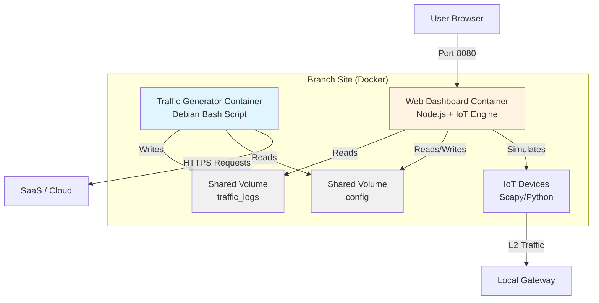
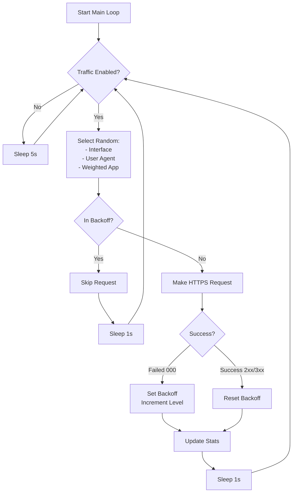
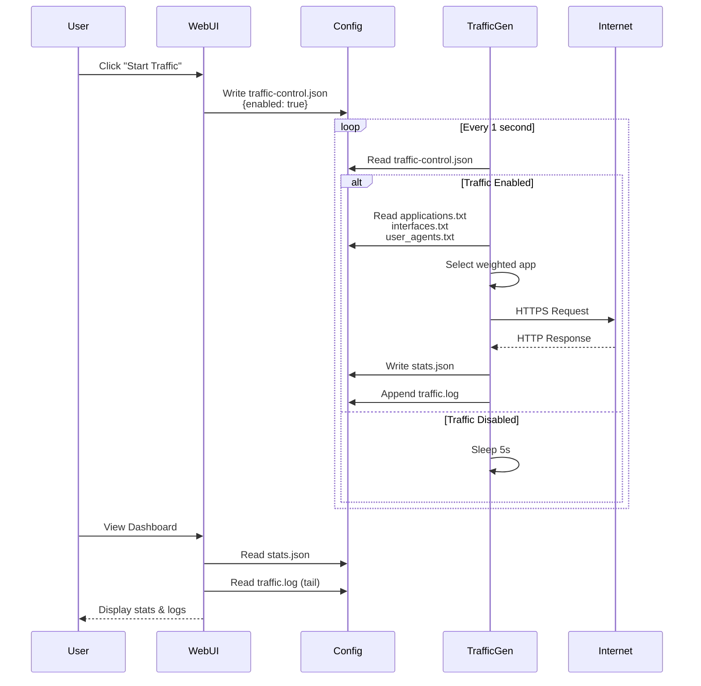
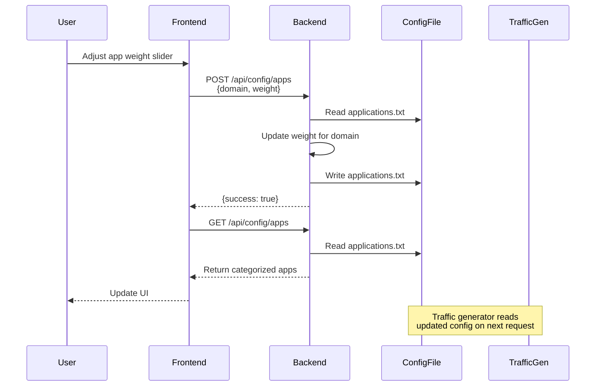

# SD-WAN Traffic Generator - Technical Specification

**Repository**: [jsuzanne/sdwan-traffic-generator-web](https://github.com/jsuzanne/sdwan-traffic-generator-web)  [](https://github.com/jsuzanne/sdwan-traffic-generator-web/releases)
**Version**: 1.2.1-patch.43
**Last Updated**: January 2026

---

## Executive Summary

The SD-WAN Traffic Generator is a realistic enterprise application traffic simulator designed for SD-WAN testing and demonstrations. It generates weighted HTTP/HTTPS traffic to various SaaS applications, simulating real-world enterprise network usage patterns. The system features a modern web dashboard for real-time monitoring, configuration management, and traffic control. **New in v1.1.2**: Advanced IoT device simulation and convergence testing capabilities.

### Key Capabilities
- **Realistic Traffic Simulation**: Generates HTTP/HTTPS requests to 60+ enterprise SaaS applications
- **Weighted Distribution**: Configurable traffic weights per application
- **IoT Simulation**: Scapy-powered Layer 2/3 simulation (ARP, DHCP, mDNS, SSDP) for 20+ device types
- **Convergence Testing**: Dedicated RTP/Voice echo server for failover and jitter measurements
- **Web Dashboard**: Real-time monitoring with live logs, statistics, and configuration UI
- **Docker Deployment**: Single-command deployment using Docker Compose (Host Mode for Lab fidelity)
- **Authentication**: JWT-based authentication with user management

---

## System Architecture

### High-Level Overview

The system consists of **two primary Docker containers** and optional targets:



### Container Architecture

#### 1. Traffic Generator Container (`sdwan-traffic-gen`)
- **Base Image**: `debian:bookworm-slim`
- **Primary Script**: [`traffic-generator.sh`](file:///Users/jsuzanne/Github/sdwan-traffic-generator/traffic-generator.sh)
- **Language**: Bash
- **Purpose**: Generates high-volume HTTP/HTTPS traffic to simulate SaaS usage

#### 2. Web Dashboard Container (`sdwan-web-ui`)
- **Base Image**: `node:20-alpine` (multi-stage)
- **Backend**: Express.js (TypeScript) + **Scapy (Python)**
- **Frontend**: React 19 + Vite + TailwindCSS 4
- **Port**: 8080 (Production Default)
- **Purpose**: Unified control plane and **IoT Simulation Engine**

### Shared Resources

#### Volume: `traffic_logs`
- **Path**: `/var/log/sdwan-traffic-gen`
- **Contents**:
  - `traffic.log` - Detailed request logs with timestamps
  - `stats.json` - Real-time statistics (updated every 50 requests)
- **Access**: Read/Write by traffic-gen, Read-only by web-ui

#### Volume: `config` (bind mount)
- **Host Path**: `./config`
- **Container Path**: `/opt/sdwan-traffic-gen/config` (traffic-gen), `/app/config` (web-ui)
- **Contents**:
  - `applications.txt` - Application list with weights
  - `interfaces.txt` - **"One Truth"** file for network interface selection (Physical Host Port)
  - `iot-devices.json` - List of simulated IoT devices and their profiles
  - `user_agents.txt` - User agent strings for requests
  - `traffic-control.json` - Start/stop control file
  - `users.json` - Authentication credentials (bcrypt hashed)

---

## Component Details

### Traffic Generator Engine

#### Core Script: `traffic-generator.sh`

**Location**: [traffic-generator.sh](file:///Users/jsuzanne/Github/sdwan-traffic-generator/traffic-generator.sh)  
**Lines of Code**: 378  
**Language**: Bash

##### Main Loop Logic



##### Key Functions

| Function | Purpose |
|----------|---------|
| `getWeightedApp()` | Weighted random selection of application based on configured weights |
| `makeRequest()` | Executes curl command with proper headers and timeout |
| `calculateBackoff()` | Determines backoff duration (1min → 5min → 30min → 1h → 3h) |
| `checkBackoff()` | Verifies if interface+app combination is in backoff period |
| `updateStats()` | Increments counters and writes `stats.json` every 50 requests |
| `writeStats()` | Generates JSON statistics file with request counts and errors |

##### Backoff Strategy

The traffic generator implements intelligent exponential backoff to avoid hammering unreachable services:

| Error Count | Backoff Duration | Variable |
|-------------|------------------|----------|
| 1st error | 1 minute | `B1=60` |
| 2nd error | 5 minutes | `B2=300` |
| 3rd error | 30 minutes | `B3=1800` |
| 4th error | 1 hour | `B4=3600` |
| 5+ errors | 3 hours | `B5=10800` |

Backoff is tracked per `interface_application` combination, allowing other routes to continue functioning.

##### Configuration Files

**applications.txt** - Format: `domain|weight|endpoint`
```
# Microsoft 365 Suite
outlook.office365.com|67|/
teams.microsoft.com|67|/api/mt/emea/beta/users/
login.microsoftonline.com|67|/

# Google Workspace
mail.google.com|72|/mail/
drive.google.com|72|/
```

**interfaces.txt** - One interface per line
```
eth0
wlan0
```

**user_agents.txt** - Realistic user agent strings
```
Mozilla/5.0 (Windows NT 10.0; Win64; x64) AppleWebKit/537.36...
Mozilla/5.0 (Macintosh; Intel Mac OS X 10_15_7)...
okhttp/4.12.0
Teams/1.6.00.4472
```

**traffic-control.json** - Start/stop control
```json
{
  "enabled": true
}
```

---

### Web Dashboard

#### Backend Server

**Location**: [server.ts](file:///Users/jsuzanne/Github/sdwan-traffic-generator/web-dashboard/server.ts)  
**Framework**: Express.js  
**Language**: TypeScript  
**Port**: 8080 (production), 3001 (development)

##### API Endpoints

| Endpoint | Method | Auth Required | Purpose |
|----------|--------|---------------|---------|
| `/api/auth/login` | POST | No | User authentication, returns JWT token |
| `/api/auth/change-password` | POST | Yes | Change current user's password |
| `/api/auth/users` | POST | Yes (admin) | Create new user account |
| `/api/status` | GET | Yes | Check if traffic generator is active (heartbeat) |
| `/api/traffic/status` | GET | Yes | Get traffic control state (enabled/disabled) |
| `/api/traffic/start` | POST | Yes | Enable traffic generation |
| `/api/traffic/stop` | POST | Yes | Disable traffic generation |
| `/api/stats` | GET | Yes | Retrieve current statistics from `stats.json` |
| `/api/config/apps` | GET | Yes | Get categorized application list with weights |
| `/api/config/apps` | POST | Yes | Update single application weight |
| `/api/config/category` | POST | Yes | Bulk update category weights |
| `/api/config/interfaces` | GET | Yes | Get configured network interfaces |
| `/api/config/interfaces` | POST | Yes | Save network interfaces |
| `/api/system/interfaces` | GET | Yes | Detect system's physical network interfaces |
| `/api/logs` | GET | Yes | Retrieve last 50 lines of traffic.log |

##### Authentication System

- **Method**: JWT (JSON Web Tokens)
- **Secret**: Environment variable `JWT_SECRET` (default: `super-secret-key-change-this`)
- **Token Expiry**: 24 hours
- **Password Hashing**: bcrypt with salt rounds = 10
- **Default Credentials**: `admin` / `admin` (created on first run)
- **User Storage**: [`config/users.json`](file:///Users/jsuzanne/Github/sdwan-traffic-generator/config/users.json)

##### Status Detection Logic

The backend determines if traffic generation is "running" by checking the timestamp in `stats.json`:

```typescript
const lastUpdate = stats.timestamp; // Unix timestamp (seconds)
const now = Math.floor(Date.now() / 1000);

if (now - lastUpdate < 15) {
    status = 'running'; // Updated within last 15 seconds
} else {
    status = 'stopped';
}
```

#### 3. IoT Simulation Engine

The IoT engine is an event-driven simulator built into the `sdwan-web-ui` container, utilizing Python and the **Scapy** library for high-fidelity Layer 2 packet generation.

##### Core Logic: `iot-manager.ts`
- **Bridge Pattern**: Communicates with the `iot_engine.py` script via a JSON-based pipe.
- **Unified Networking**: Shares the same `interfaces.txt` as the Traffic Generator, ensuring all simulated devices emerge from the correct physical port.
- **Mac/Linux Support**: Automatically switches between `libpcap` (macOS) and raw sockets (Linux).

##### Simulated Device Types
The system simulates 20+ device profiles, including:
- **Smart Home**: Philips Hue, Sonos, Amazon Echo
- **Industrial**: PLC, Smart Meter, HVAC Controller
- **Office**: IP Phones (Cisco/Poly), Printers, Security Cameras

##### Traffic Patterns
- **Discovery**: Periodic mDNS, SSDP, and ARP announcements.
- **Control**: Simulated TCP/UDP telemetry to cloud endpoints.
- **L2 Management**: Full DHCP lifecycle for each simulated device MAC.

#### Frontend Application

**Location**: [web-dashboard/src/](file:///Users/jsuzanne/Github/sdwan-traffic-generator/web-dashboard/src)  
**Framework**: React 19  
**Build Tool**: Vite  
**Styling**: TailwindCSS 4  
**Charts**: Recharts

##### Component Structure

| Component | File | Purpose |
|-----------|------|---------|
| `App.tsx` | [App.tsx](file:///Users/jsuzanne/Github/sdwan-traffic-generator/web-dashboard/src/App.tsx) | Main dashboard with navigation, stats display, and live logs |
| `Login.tsx` | [Login.tsx](file:///Users/jsuzanne/Github/sdwan-traffic-generator/web-dashboard/src/Login.tsx) | Authentication form with username/password |
| `Config.tsx` | [Config.tsx](file:///Users/jsuzanne/Github/sdwan-traffic-generator/web-dashboard/src/Config.tsx) | Configuration interface for apps and network interfaces |
| `Statistics.tsx` | [Statistics.tsx](file:///Users/jsuzanne/Github/sdwan-traffic-generator/web-dashboard/src/Statistics.tsx) | Detailed statistics view with charts and breakdowns |

##### Dashboard Features

**Main Dashboard View**:
- **Status Cards**: Total requests, active apps, error rate, uptime
- **Traffic Control**: Start/Stop button with real-time status
- **Live Chart**: Request rate over time (last 10 data points)
- **Live Logs**: Auto-refreshing log tail (last 50 lines)
- **Navigation**: Tabs for Dashboard, Statistics, Configuration, Settings

**Statistics View**:
- Request distribution by application (pie chart)
- Top applications by volume (bar chart)
- Error rates per application
- Success rate percentage

**Configuration View**:
- Categorized application list (Microsoft 365, Google Workspace, etc.)
- Weight sliders per application (0-100)
- Bulk category weight adjustment
- Network interface management
- Auto-detect system interfaces

**Settings View**:
- Change password
- Add new users (admin only)
- Logout

##### Technology Stack

```json
{
  "dependencies": {
    "react": "^19.2.0",
    "react-dom": "^19.2.0",
    "tailwindcss": "^4.1.17",
    "recharts": "^3.5.1",
    "lucide-react": "^0.556.0",
    "express": "^5.2.1",
    "jsonwebtoken": "^9.0.3",
    "bcryptjs": "^3.0.3"
  }
}
```

---

## Docker Configuration

### Docker Compose Setup

**File**: [docker-compose.yml](file:///Users/jsuzanne/Github/sdwan-traffic-generator/docker-compose.yml)

```yaml
services:
  traffic-gen:
    build:
      context: .
      dockerfile: Dockerfile.traffic-gen
    container_name: sdwan-traffic-gen
    restart: unless-stopped
    volumes:
      - ./config:/opt/sdwan-traffic-gen/config
      - traffic_logs:/var/log/sdwan-traffic-gen
    environment:
      - SLEEP_BETWEEN_REQUESTS=1

  web-ui:
    build:
      context: ./web-dashboard
      dockerfile: Dockerfile
    container_name: sdwan-web-ui
    restart: unless-stopped
    volumes:
      - ./config:/app/config
      - traffic_logs:/var/log/sdwan-traffic-gen
    ports:
      - "8080:8080"
    environment:
      - NODE_ENV=production
      - PORT=8080

volumes:
  traffic_logs:
```

### Dockerfile: Traffic Generator

**File**: [Dockerfile.traffic-gen](file:///Users/jsuzanne/Github/sdwan-traffic-generator/Dockerfile.traffic-gen)

```dockerfile
FROM debian:bookworm-slim

RUN apt-get update && apt-get install -y \
    curl jq ca-certificates dos2unix \
    && rm -rf /var/lib/apt/lists/*

WORKDIR /app
COPY traffic-generator.sh /app/
RUN dos2unix /app/traffic-generator.sh && chmod +x /app/traffic-generator.sh
RUN mkdir -p /var/log/sdwan-traffic-gen /opt/sdwan-traffic-gen/config

CMD ["./traffic-generator.sh", "client-docker"]
```

### Dockerfile: Web Dashboard

**File**: [web-dashboard/Dockerfile](file:///Users/jsuzanne/Github/sdwan-traffic-generator/web-dashboard/Dockerfile)

**Multi-stage build**:
1. **Builder Stage**: Compiles TypeScript and builds React app with Vite
2. **Runtime Stage**: Runs Express server with `tsx` to serve API and static files

```dockerfile
# Build Stage
FROM node:20-alpine AS builder
WORKDIR /app
COPY package*.json ./
RUN npm ci
COPY . .
RUN npm run build

# Runtime Stage
FROM node:20-alpine
WORKDIR /app
RUN apk add --no-cache curl
COPY package*.json ./
RUN npm ci --omit=dev && npm install tsx
COPY --from=builder /app/dist ./dist
COPY server.ts tsconfig.json ./

ENV NODE_ENV=production
ENV PORT=3000
EXPOSE 3000

CMD ["npx", "tsx", "server.ts"]
```

---

## Data Flow

### Traffic Generation Flow



### Configuration Update Flow



---

## Application Categories

The system includes **60+ enterprise SaaS applications** across 15 categories:

| Category | Example Applications | Default Weight Range |
|----------|---------------------|---------------------|
| **Microsoft 365 Suite** | Outlook, Teams, OneDrive, SharePoint | 67-90 |
| **Google Workspace** | Gmail, Drive, Docs, Meet, Calendar | 70-90 |
| **Communication & Collaboration** | Zoom, Slack, Webex, Discord | 40-90 |
| **CRM & Sales** | Salesforce, HubSpot, Dynamics 365 | 41-80 |
| **Project Management** | Monday, Asana, Trello, Jira, Confluence | 55-70 |
| **Cloud Storage** | Dropbox, Box, WeTransfer | 45-75 |
| **Development & DevOps** | GitHub, GitLab, Bitbucket, Stack Overflow | 45-75 |
| **Cloud Providers** | Azure Portal, AWS Console, GCP Console | 65-70 |
| **Business Intelligence** | Tableau, Power BI, Looker | 40-55 |
| **HR & Productivity** | Workday, BambooHR, Zenefits, ADP | 35-55 |
| **Marketing & Social** | LinkedIn, Twitter, Facebook, Instagram | 45-60 |
| **Design & Creative** | Figma, Canva, Adobe | 45-55 |
| **Customer Support** | Zendesk, Intercom, Freshdesk | 40-60 |
| **Finance & Accounting** | QuickBooks, Expensify, Stripe | 40-50 |
| **Security & IT Tools** | Okta, Duo, 1Password, LastPass | 35-55 |

---

## Deployment & Operations

### Quick Start

```bash
# Clone repository
git clone https://github.com/jsuzanne/sdwan-traffic-generator-web.git
cd sdwan-traffic-generator-web

# Start services
docker-compose up -d

# Access dashboard
open http://localhost:8080
```

### Default Credentials
- **Username**: `admin`
- **Password**: `admin`

> [!WARNING]
> Change the default password immediately after first login via Settings → Change Password

### Management Commands

```bash
# View logs
docker-compose logs -f traffic-gen
docker-compose logs -f web-ui

# Restart services
docker-compose restart

# Stop services
docker-compose down

# Rebuild after code changes
docker-compose up -d --build
```

### Configuration Persistence

All configuration is stored in the `./config` directory (bind-mounted):
- Survives container restarts
- Can be edited directly or via web UI
- Changes take effect on next traffic generation cycle (1-5 seconds)

### Log Files

**traffic.log** - Detailed request logs:
```
[2025-12-09 00:45:32] [INFO] client-docker requesting https://teams.microsoft.com/api/mt/emea/beta/users/ via eth0 (traceid: 1733705132-client-docker)
[2025-12-09 00:45:33] [INFO] client-docker SUCCESS https://teams.microsoft.com/api/mt/emea/beta/users/ - code: 200
```

**stats.json** - Real-time statistics:
```json
{
  "timestamp": 1733705133,
  "client_id": "client-docker",
  "total_requests": 1250,
  "requests_by_app": {
    "teams": 87,
    "outlook": 92,
    "mail": 78
  },
  "errors_by_app": {
    "teams": 2,
    "outlook": 0
  }
}
```

---

## Security Considerations

### Authentication
- JWT tokens with 24-hour expiry
- Bcrypt password hashing (10 salt rounds)
- All API endpoints protected except `/api/auth/login`
- Admin-only user creation

### Network Security
- Traffic generator makes **outbound HTTPS requests only**
- No inbound connections to traffic-gen container
- Web UI exposed on port 8080 (can be changed in docker-compose.yml)

### Recommendations
1. Change default admin password immediately
2. Set custom `JWT_SECRET` environment variable
3. Use reverse proxy (nginx/Traefik) with TLS for production
4. Restrict port 8080 to trusted networks
5. Regularly update Docker images

---

## Development

### Local Development Setup

```bash
cd web-dashboard

# Install dependencies
npm install

# Run development servers (Vite + Express)
npm run dev
# Frontend: http://localhost:5173
# Backend: http://localhost:3001
```

### Project Structure

```
sdwan-traffic-generator/
├── config/                      # Configuration files (bind-mounted)
│   ├── applications.txt         # App list with weights
│   ├── interfaces.txt           # Network interfaces
│   ├── user_agents.txt          # User agent strings
│   ├── traffic-control.json     # Start/stop control
│   └── users.json               # User credentials
├── web-dashboard/               # Web UI source code
│   ├── src/
│   │   ├── App.tsx              # Main dashboard component
│   │   ├── Config.tsx           # Configuration UI
│   │   ├── Statistics.tsx       # Statistics view
│   │   ├── Login.tsx            # Authentication form
│   │   └── main.tsx             # React entry point
│   ├── server.ts                # Express backend API
│   ├── Dockerfile               # Web UI container
│   ├── package.json             # Dependencies
│   └── vite.config.ts           # Vite configuration
├── traffic-generator.sh         # Core traffic generation script
├── Dockerfile.traffic-gen       # Traffic generator container
├── docker-compose.yml           # Multi-container orchestration
├── build-and-push.sh            # Build script
└── README.md                    # User documentation
```

### Build Process

**Frontend Build** (Vite):
```bash
npm run build
# Output: web-dashboard/dist/
```

**Backend Runtime** (Express):
- Development: `tsx watch server.ts`
- Production: `npx tsx server.ts` (runs in Docker)

---

## Future Enhancements

Potential improvements for future versions:

1. **Jitter & Latency Injection**: Add software-based impairment for testing.
2. **Scheduling**: Time-based traffic patterns (business hours simulation).
3. **Metrics Export**: Prometheus/Grafana integration.
4. **Bandwidth Control**: Configurable throughput limits.
5. **Kubernetes**: Helm chart for K8s deployment.

---

## Troubleshooting

### Traffic Not Starting

**Symptom**: Dashboard shows "Stopped" even after clicking Start

**Solutions**:
1. Check `config/traffic-control.json` contains `{"enabled": true}`
2. Verify `config/interfaces.txt` has valid network interfaces
3. Check traffic-gen container logs: `docker-compose logs traffic-gen`
4. Ensure `config/applications.txt` has valid entries

### No Statistics Displayed

**Symptom**: Dashboard shows "No data available"

**Solutions**:
1. Wait 15 seconds after starting traffic (stats update every 50 requests)
2. Check if `stats.json` exists: `docker exec sdwan-traffic-gen ls -la /var/log/sdwan-traffic-gen/`
3. Verify shared volume is mounted correctly

### Authentication Issues

**Symptom**: Cannot login with admin/admin

**Solutions**:
1. Check `config/users.json` exists and is readable
2. Delete `users.json` and restart web-ui to recreate default admin
3. Verify JWT_SECRET environment variable is consistent

### Network Interface Errors

**Symptom**: Logs show "curl: (45) Could not resolve host"

**Solutions**:
1. Use `docker exec sdwan-traffic-gen ip addr` to list available interfaces
2. Update `config/interfaces.txt` with valid interface names
3. For Docker, use `eth0` (default container interface)

---

## License

MIT License - See repository for full license text

---

## Conclusion

This SD-WAN Traffic Generator provides a comprehensive solution for simulating realistic enterprise application traffic. The combination of a lightweight Bash-based traffic engine and a modern React dashboard offers both performance and usability. The Docker-based deployment ensures consistent operation across environments, while the configurable application weights allow for customized traffic patterns matching specific enterprise scenarios.

For questions or contributions, visit the [GitHub repository](https://github.com/jsuzanne/sdwan-traffic-generator-web).
