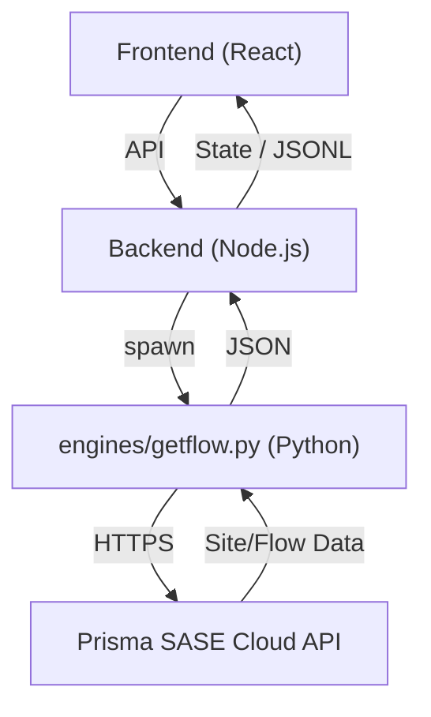
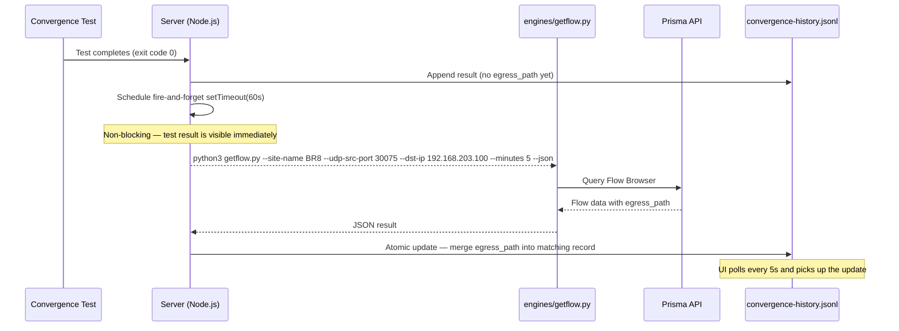

# Prisma SD-WAN Integration Guide

[](https://hub.docker.com/r/jsuzanne/sdwan-traffic-gen)
[](https://pan.dev/sase/)

This guide provides complete instructions for integrating **Prisma SD-WAN API** into the SD-WAN Traffic Generator and using the `getflow.py` engine in standalone mode.

---

## 📋 Table of Contents

1. [Overview](#overview)
2. [Application Integration](#part-1-application-integration)
   - [How It Works](#how-it-works)
   - [Configuration (.env Setup)](#configuration-env-setup)
   - [Features Enabled](#features-enabled)
3. [Egress Path Enrichment for Convergence Tests](#egress-path-enrichment)
4. [Standalone Usage](#part-2-standalone-usage)
   - [Installation](#installation)
   - [Command Reference](#command-reference)
   - [Use Cases](#use-cases)
5. [Troubleshooting](#troubleshooting)
6. [Security Best Practices](#security-best-practices)

---

## 🔍 Overview

The SD-WAN Traffic Generator leverages the **Prisma SD-WAN API** (CloudGenix) to provide a "Zero-Config" experience:

- **Site Auto-Detection**: Automatically identifies the local branch site name and ID.
- **Dynamic Targets**: Discover all LAN interfaces across the tenant for convergence test targets.
- **Egress Path Enrichment**: After each convergence test, automatically queries the Flow Browser to display which SD-WAN path was used (e.g. `BR8-INET2 → DC2-INET`).
- **Metadata Enrichment**: Enhances the UI with friendly interface names and site metadata.

> [!NOTE]
> The core engine for this integration is `engines/getflow.py`, which uses the official Prisma SASE SDK.

---

## 🛠 Part 1: Application Integration

### How It Works



### Configuration (.env Setup)

#### Step 1: Generate API Credentials

1. Log in to **Prisma Access** / **Strata Cloud Manager**.
2. Navigate to: **Settings** → **Service Accounts**.
3. Create a Service Account and note the:
   - **Client ID** (e.g., `app@123456.iam.panserviceaccount.com`)
   - **Client Secret**
   - **TSG ID** (Tenant Service Group ID)

> [!IMPORTANT]
> Ensure the service account has at least `prisma-sdwan-config.read` and `prisma-sdwan-monitor.read` permissions.

#### Step 2: Configure Environment

Add the following to your `.env` file or `docker-compose.yml`:

```bash
# Required Credentials
PRISMA_SDWAN_CLIENT_ID="abc@123.iam.panserviceaccount.com"
PRISMA_SDWAN_CLIENT_SECRET="your-secret"
PRISMA_SDWAN_TSG_ID="1234567890"

# Optional Settings
PRISMA_SDWAN_REGION="de"      # de, us, uk, etc.
PRISMA_SDWAN_CACHE_TTL=600    # Cache in seconds (default 10 min)

# Debug mode — enables verbose getflow.py logs in docker compose logs
DEBUG=true
```

---

### Features Enabled

When configured, the application unlocks:

| Feature | Description |
|---|---|
| **Site Badge** | Detected site name and subnet shown in the header |
| **Smart Target Selector** | Convergence Lab targets auto-populated from DC LAN interfaces |
| **Egress Path Enrichment** | Flow Browser queried post-test to show the active SD-WAN path |
| **Friendly Labels** | Interfaces show as `eth0 (MPLS)` instead of raw IDs |

---

## 🛣️ Egress Path Enrichment

### Overview

After each convergence test completes, the backend **automatically enriches** the result with the SD-WAN path that was used, querying the Prisma Flow Browser 60 seconds later (to allow flow indexing in the API).

The path is displayed in the **EGRESS PATH** widget in the Convergence History card:

```
UPLINK LOSS | DOWNLINK LOSS | AVG LATENCY | JITTER | EGRESS PATH
    0%             0%          10.33ms      5.46ms   BR8-INET2 → DC2-INET
```

### How It Works



### Port Convention

Each convergence test uses a **deterministic UDP source port** based on the test counter:

```
Source Port = 30000 + test_number
```

For example, `CONV-0075` uses UDP source port `30075`. This allows `getflow.py` to uniquely identify the flow without ambiguity.

### Requirements

| Requirement | Detail |
|---|---|
| Prisma credentials | `PRISMA_SDWAN_CLIENT_ID`, `CLIENT_SECRET`, `TSG_ID` in `.env` |
| Site detection | The backend must have successfully auto-detected the local site name |
| `getflow.py` | Must be present at `engines/getflow.py` (included in the Docker image) |

### Graceful Degradation

The enrichment is **fully non-blocking and silent on failure**:

| Scenario | Behavior |
|---|---|
| No credentials configured | Site name `null` → skip silently |
| `getflow.py` not found | Log warning → skip |
| No flow returned | JSONL unchanged — widget shows `—` for older tests |
| Test < 3 min old, no path yet | Widget shows `⏳ fetching...` |

### Manual Query (Standalone Verification)

To manually verify the path for a specific test:

```bash
# From the Docker container
docker compose exec web-ui python3 /app/engines/getflow.py \
  --site-name BR8 \
  --udp-src-port 30075 \
  --dst-ip 192.168.203.100 \
  --minutes 5 \
  --json
```

Expected output:
```json
{
  "success": true,
  "site_name": "BR8",
  "flows": [
    {
      "source_ip": "192.168.219.1",
      "source_port": 30075,
      "egress_path": "BR8-INET2 to DC2-INET",
      "path_type": "VPN"
    }
  ]
}
```

> [!TIP]
> Enable `DEBUG=true` in your environment to see verbose getflow logs in `docker compose logs -f | grep CONV`.

---

## 🐍 Part 2: Standalone Usage

### Installation

```bash
# 1. Install SDK
pip3 install prisma-sase

# 2. Run the script
./engines/getflow.py --auto-detect --json
```

### Command Reference

| Command | Description |
|---|---|
| `--list-sites` | List all SD-WAN sites in the tenant |
| `--list-lan-interfaces` | List all LAN subnets across all branches |
| `--list-dc-lan-interfaces` | List only DC/Hub LAN interfaces (for targets) |
| `--auto-detect` | Detect local site based on container IP |
| `--site-name <name>` | Target a specific site by name |
| `--udp-src-port <port>` | Filter flows by UDP source port |
| `--dst-ip <ip>` | Filter flows by destination IP |
| `--minutes <n>` | Flow history window in minutes (default 5) |
| `--json` | Return output in machine-readable JSON format |

---

## 📈 Use Cases

### 1. Verify Active Path After a Convergence Test
```bash
./engines/getflow.py \
  --site-name BR8 \
  --udp-src-port 30075 \
  --dst-ip 192.168.203.100 \
  --minutes 5 \
  --json
```

### 2. Verify Path Selection After Failover (All Flows)
```bash
./engines/getflow.py --site-name BR8 --minutes 5 --json
```

### 3. Bulk Target Discovery
```bash
./engines/getflow.py --list-dc-lan-interfaces --json | jq -r '.dc_lan_interfaces[].ip'
```

---

## ❓ Troubleshooting

### Authentication Errors
- **Symptom**: `401 Unauthorized` or `Invalid credentials`
- **Fix**: Verify `PRISMA_SDWAN_TSG_ID` matches the Client ID's tenant portion. Ensure no trailing spaces in `.env`.

### Site Detection Failure
- **Symptom**: `Could not find site matching local IP`
- **Reason**: The container is on a network not defined as a LAN subnet in Prisma SD-WAN
- **Fix**: Check `used_for=lan` configuration on the ION interface

### No Flows Found (Egress Path Shows `—`)
- **Symptom**: `egress_path` never appears in the UI, flow list is empty
- **Reasons**:
  - Prisma logs take 30–120s to appear in the API → the 60s delay is intentional
  - Traffic not going through SD-WAN (direct route)
  - Wrong time range (`--minutes` too short)
  - IP/port filter mismatch
- **Fix**:
  ```bash
  # Increase time range
  ./engines/getflow.py --site-name BR8 --udp-src-port 30075 --minutes 10 --json

  # Remove IP filter to see all flows
  ./engines/getflow.py --site-name BR8 --minutes 5 --json | jq '.flows | length'
  ```

### Region / Timeout Errors
- **Symptom**: `Error: timeout of 30000ms exceeded`
- **Fix**:
  ```bash
  # Try the correct region
  ./engines/getflow.py --list-sites --region de   # Europe
  ./engines/getflow.py --list-sites --region us   # Americas

  # Test API reachability
  curl -I https://api.sase.paloaltonetworks.com/sdwan/v3.6/api/sites
  # 401 Unauthorized = API is reachable
  ```

---

## 🔒 Security Best Practices

> [!CAUTION]
> Never commit your `.env` file containing Prisma credentials to public repositories.

1. **Least Privilege** — Grant `read` permissions only (`prisma-sdwan-config.read`, `prisma-sdwan-monitor.read`)
2. **Environment Variables** — Use Docker Compose env or a secrets manager, never hardcode
3. **Rotate Regularly** — Rotate service account credentials every 90 days
4. **File Permissions** — `chmod 600 .env`
5. **Debug Mode** — Only enable `DEBUG=true` when actively troubleshooting; disable in production

```yaml
# docker-compose.yml (production)
services:
  sdwan-web-ui:
    environment:
      - PRISMA_SDWAN_CLIENT_ID=${PRISMA_SDWAN_CLIENT_ID}
      - PRISMA_SDWAN_CLIENT_SECRET=${PRISMA_SDWAN_CLIENT_SECRET}
      - PRISMA_SDWAN_TSG_ID=${PRISMA_SDWAN_TSG_ID}
      # - DEBUG=true  # Uncomment only for troubleshooting
```

---

## 📚 Resources

- [GitHub Issues](https://github.com/jsuzanne/sdwan-traffic-generator-web/issues)
- [Prisma SASE API Docs](https://pan.dev/sase/)
- [prisma-sase Python SDK](https://pypi.org/project/prisma-sase/)
- [Live Community SD-WAN Forum](https://live.paloaltonetworks.com/t5/prisma-sd-wan/ct-p/Prisma_SD-WAN)
