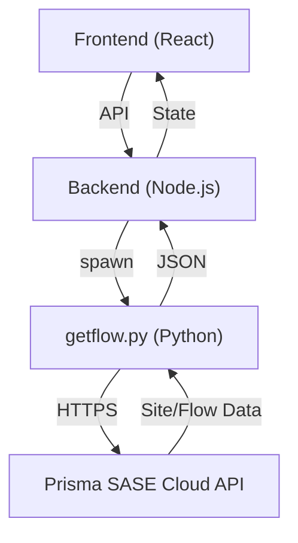

# Prisma SD-WAN Integration Guide

[](https://hub.docker.com/r/jsuzanne/sdwan-traffic-gen)
[](https://pan.dev/sase/)

This guide provides complete instructions for integrating **Prisma SD-WAN API** into the SD-WAN Traffic Generator application and using the `getflow.py` engine in standalone mode.

---

## 📋 Table of Contents

1. [Overview](#overview)
2. [Application Integration](#part-1-application-integration)
   - [How It Works](#how-it-works)
   - [Configuration (.env Setup)](#configuration-env-setup)
   - [Features Enabled](#features-enabled)
   - [Auto-Detection Workflow](#auto-detection-workflow)
   - [Probe Auto-Registration](#probe-auto-registration)
3. [Standalone Usage](#part-2-standalone-usage)
   - [Installation](#installation)
   - [Command Reference](#command-reference)
   - [Specific Use Cases](#use-cases)
4. [Troubleshooting](#troubleshooting)
5. [Security Best Practices](#security-best-practices)

---

## 🔍 Overview

The SD-WAN Traffic Generator leverages the **Prisma SD-WAN API** (CloudGenix) to provide a "Zero-Config" experience:

- **Site Auto-Detection**: Automatically identifies the local branch site name and ID.
- **Dynamic Targets**: Discover all LAN interfaces across the tenant for convergence test targets.
- **Path Validation**: Queries flow logs to verify traffic path selection (VPN, Internet, MPLS).
- **Metadata Enrichment**: Enhances the UI with friendly interface names and site metadata.

> [!NOTE]
> The core engine for this integration is `getflow.py`, which uses the official Prisma SASE SDK.

---

## 🛠 Part 1: Application Integration

### How It Works



### Configuration (.env Setup)

#### Step 1: Generate API Credentials

1. Log in to **Prisma Access** / **Strata Cloud Manager**.
2. Navigate to: **Settings** → **Service Accounts**.
3. Create a Service Account and note the:
   - **Client ID** (e.g., `app@123456.iam.panserviceaccount.com`)
   - **Client Secret**
   - **TSG ID** (Tenant Service Group ID)

> [!IMPORTANT]
> Ensure the service account has at least `prisma-sdwan-config.read` and `prisma-sdwan-monitor.read` permissions.

#### Step 2: Configure Environment

Add the following to your `.env` file or `docker-compose.yml`:

```bash
# Required Credentials
PRISMA_SDWAN_CLIENT_ID="abc@123.iam.panserviceaccount.com"
PRISMA_SDWAN_CLIENT_SECRET="your-secret"
PRISMA_SDWAN_TSG_ID="1234567890"

# Optional Settings
PRISMA_SDWAN_REGION="de"  # de, us, uk, etc.
PRISMA_SDWAN_CACHE_TTL=600  # Seconds (default 10 min)
```

---

### Features Enabled

When configured, the application unlocks:

1.  **Site Badge**: Displays detected site name and network subnet in the header.
2.  **Smart Target Selector**: In the Convergence Lab, targets are auto-populated from discovered DC interfaces.
3.  **Path Name Resolution**: Test results show names like `BR8-Internet1 → DC1-MPLS` instead of generic IDs.
4.  **Friendly Labels**: Interfaces show as `1 (Users VLAN)` instead of just `1`.

---

### Probe Auto-Registration

The application can automatically register itself as a probe for its detected site. This is ideal for mass deployments across branches.

1.  Container starts and runs `--auto-detect`.
2.  Backend identifies site (e.g., `Branch-Paris`).
3.  Backend creates a deterministic probe name and registers it in the system.
4.  **Zero manual touch required.**

---

## 🐍 Part 2: Standalone Usage

### Installation

```bash
# 1. Install SDK
pip3 install prisma-sase

# 2. Run the script
./getflow.py --auto-detect --json
```

### Command Reference

| Command | Description |
| :--- | :--- |
| `--list-sites` | List all SD-WAN sites in the tenant. |
| `--list-lan-interfaces` | List all LAN subnets across all branches. |
| `--list-dc-lan-interfaces` | List only DC/Hub LAN interfaces (for targets). |
| `--auto-detect` | Detect local site based on container IP. |
| `--udp-src-port <port>` | Query flows for a specific UDP session. |
| `--json` | Return output in machine-readable JSON format. |

---

## 📈 Use Cases

### 1. Verify Path Selection
Query flows after a failover test to confirm the ION moved traffic to the backup circuit:
```bash
./getflow.py --auto-detect --udp-src-port 30030 --minutes 5 --json
```

### 2. Bulk Target Discovery
Retrieve all DC IP addresses to run a sweep test:
```bash
./getflow.py --list-dc-lan-interfaces --json | jq -r '.dc_lan_interfaces[].ip'
```

---

## ❓ Troubleshooting

### Authentication Errors
- **Symptom**: `401 Unauthorized` or `Invalid credentials`.
- **Fix**: Verify `PRISMA_SDWAN_TSG_ID` matches the Client ID's tenant portion. Ensure no trailing spaces in `.env`.

### Site Detection Failure
- **Symptom**: `Could not find site matching local IP`.
- **Reason**: The container is running on a network NOT defined as a LAN subnet in Prisma SD-WAN.
- **Fix**: Check `used_for=lan` configuration on the ION interface.

### No Flows Found
- **Symptom**: Flow list is empty `[]`.
- **Reason**: Prisma logs take 30-120 seconds to appear in the API.
- **Fix**: Wait 2 minutes after a test before querying flows.

---

## 🔒 Security Best Practices

> [!CAUTION]
> Never commit your `.env` file containing Prisma credentials to public repositories.

1. Use **Ephemeral Service Accounts** where possible.
2. Apply **Principle of Least Privilege** (Read-Only access is sufficient).
3. If using in Kubernetes, store credentials in **Secrets**.
  "flows": []
}
Causes:

Test hasn't started yet

Traffic is not going through SD-WAN (direct route)

Wrong time range (--minutes too short)

Wrong filter (port/IP mismatch)

Fix:

bash
# Increase time range
./getflow.py --site-name BR8 --udp-src-port 30030 --minutes 10 --json

# Remove filters to see all flows
./getflow.py --site-name BR8 --minutes 5 --json | jq '.flows | length'
# Should show total flow count

# Check if traffic is using SD-WAN
./getflow.py --site-name BR8 --src-ip 192.168.219.10 --dst-ip 192.168.207.5 --json
Issue 4: Slow Performance
Symptom:

bash
./getflow.py --list-lan-interfaces
# Takes 10+ seconds
Causes:

Large number of sites (50+)

High network latency to Prisma API

Not using --fast mode for flow queries

Fix:

bash
# Use --fast mode for flow queries (3x faster)
./getflow.py --site-name BR8 --udp-src-port 30030 --json --fast

# Cache results in backend (Node.js example)
const cache = new Map();
const CACHE_TTL = 600000; // 10 minutes

app.get('/api/prisma/interfaces/lan', async (req, res) => {
  const cached = cache.get('lan_interfaces');
  if (cached && Date.now() < cached.expiry) {
    return res.json(cached.data);
  }

  const { stdout } = await execPromise('./Scripts/getflow.py --list-lan-interfaces --json');
  const data = JSON.parse(stdout);

  cache.set('lan_interfaces', {
    data,
    expiry: Date.now() + CACHE_TTL
  });

  res.json(data);
});
Issue 5: "Region error" / Timeout
Symptom:

text
Error: timeout of 30000ms exceeded
Causes:

Wrong region (using --region us in Europe or vice versa)

Firewall blocking api.sase.paloaltonetworks.com

Fix:

bash
# Try different region
./getflow.py --list-sites --region de  # Europe
./getflow.py --list-sites --region us  # Americas

# Test connectivity
curl -I https://api.sase.paloaltonetworks.com/sdwan/v3.6/api/sites
# Should return 401 Unauthorized (means API is reachable)
Security Best Practices
1. Never Commit Credentials
bash
# .gitignore
credentials.json
.env
docker-compose.override.yml
2. Use Environment Variables in Production
text
# docker-compose.yml (production)
services:
  sdwan-web-ui:
    environment:
      - PRISMA_SDWAN_CLIENT_ID=${PRISMA_SDWAN_CLIENT_ID}
      - PRISMA_SDWAN_CLIENT_SECRET=${PRISMA_SDWAN_CLIENT_SECRET}
      - PRISMA_SDWAN_TSG_ID=${PRISMA_SDWAN_TSG_ID}
Then:

bash
# Export secrets before starting
export PRISMA_SDWAN_CLIENT_ID="..."
export PRISMA_SDWAN_CLIENT_SECRET="..."
export PRISMA_SDWAN_TSG_ID="..."

docker compose up -d
3. Restrict File Permissions
bash
chmod 600 credentials.json
chmod 600 .env
4. Use Read-Only Service Accounts
When creating the service account in Prisma Access:

Grant: read permissions only

Deny: write, delete permissions

Scope: Limit to SD-WAN resources only (not Prisma Access config)

5. Rotate Credentials Regularly
bash
# Every 90 days
1. Create new service account in Prisma Access
2. Update .env file
3. Restart containers: docker compose restart
4. Delete old service account after 24h grace period
6. Audit API Usage
Enable logging in production:

text
services:
  sdwan-web-ui:
    environment:
      - PRISMA_SDWAN_DEBUG=true  # Logs all API calls
    volumes:
      - ./logs:/var/log/sdwan
Review logs weekly:

bash
grep "Prisma API" /var/log/sdwan/app.log | tail -100
Support & Resources
GitHub Issues: sdwan-traffic-generator-web/issues

Prisma SASE API Docs: pan.dev/sase/

SDK Reference: prisma-sase-sdk-python

Community: Live Community SD-WAN Forum
