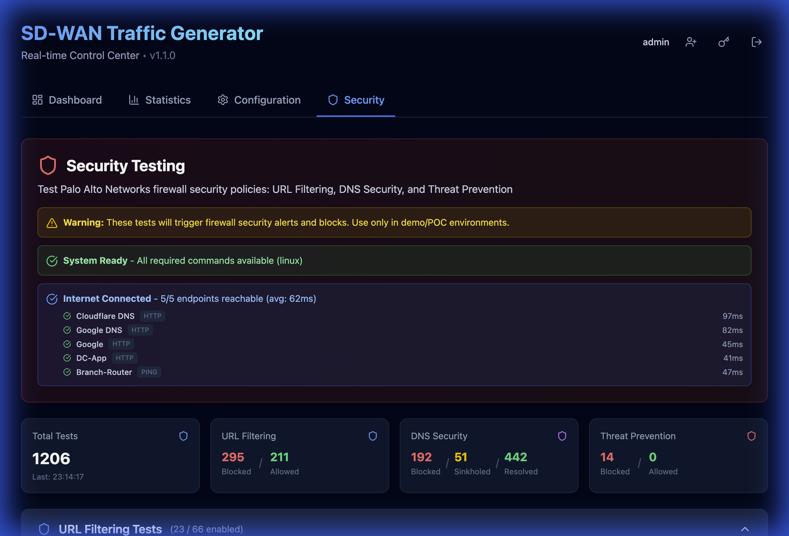
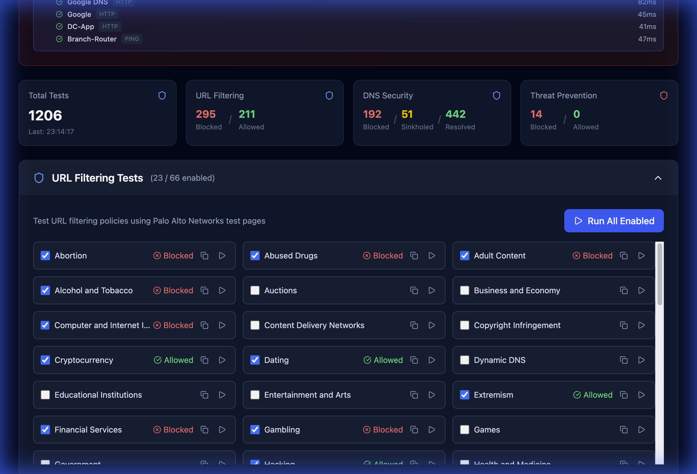
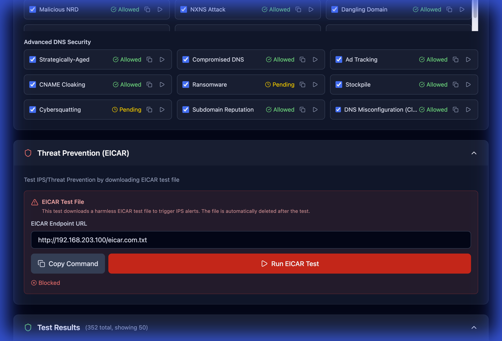
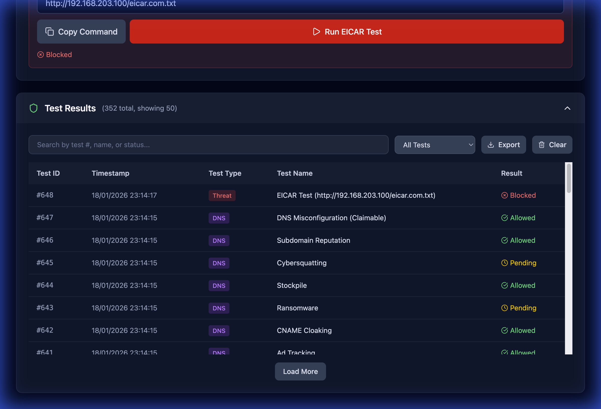

# Security Testing Feature - Technical Documentation

## Overview

The Security Testing feature enables controlled testing of Palo Alto Networks / Prisma Access security policies for demos and POCs. It provides automated testing of URL Filtering, DNS Security, and Threat Prevention capabilities.

**Version:** 1.2.1-patch.86  
**Last Updated:** 2026-02-18

---

## Screenshots

### Security Overview Dashboard


*Real-time summary of URL filtering, DNS security, and threat prevention test results with system health monitoring*

### URL Filtering Tests


*Test 66 different URL categories including malware, phishing, gambling, adult content, and more*

### DNS Security Tests


*Validate DNS security policies with basic and advanced test domains*

### Threat Prevention


*EICAR file download testing for IPS validation*

### Test Results History


*Persistent logging with search, filtering, pagination, and export capabilities*

---

## Table of Contents

1. [Architecture](#architecture)
2. [Configuration](#configuration)
3. [API Endpoints](#api-endpoints)
4. [Frontend Components](#frontend-components)
5. [Test Categories](#test-categories)
6. [Scheduled Execution](#scheduled-execution)
7. [Statistics Tracking](#statistics-tracking)
8. [Persistent Logging](#persistent-logging)
9. [EDL Testing](#edl-testing)
10. [Maintenance](#maintenance)

---

## Architecture

### System Components

```
┌─────────────────────────────────────────────────────────────┐
│                      Frontend (React)                        │
│  - Security.tsx (Main Component)                            │
│  - Statistics Dashboard                                      │
│  - Split-Scheduler Controls (URL, DNS, Threat)               │
│  - Execution Log Display                                     │
└──────────────────────┬──────────────────────────────────────┘
                       │ REST API
┌──────────────────────▼──────────────────────────────────────┐
│                   Backend (Node.js/Express)                  │
│  - API Endpoints (Config, Tests, Results)                    │
│  - Test Execution Engine (curl/nslookup)                    │
│  - Split-Scheduler (URL, DNS, Threat jobs)                  │
│  - Statistics Tracker                                        │
└──────────────────────┬──────────────────────────────────────┘
                       │
┌──────────────────────▼──────────────────────────────────────┐
│              Configuration & Data Storage                    │
│  - config/security-tests.json                               │
│  - Test History (last 50 results)                           │
│  - Statistics (blocked/allowed counts)                       │
└─────────────────────────────────────────────────────────────┘
```

### Data Flow

**Manual Test Execution:**
```
User clicks "Run All Enabled"
  → Frontend calls /api/security/url-test-batch
  → Backend executes curl commands for each enabled category
  → Results logged to test_history
  → Statistics updated (blocked/allowed counters)
  → Frontend refreshes and displays results
```

**Scheduled Test Execution (Split-Scheduler):**
```
Independent Scheduler (URL, DNS, or Threat) triggers
  → Specific runScheduled[Type]Tests() executes
  → Runs subset of enabled tests for that category
  → Updates statistics automatically
  → Updates specific last_run_time and next_run_time
  → Continues in background
```

---

## Configuration

### File Location
`config/security-tests.json`

### Schema (v1.1.0-patch.30)

```json
{
  "url_filtering": {
    "enabled_categories": ["malware", "phishing"],
    "protocol": "http"
  },
  "dns_security": {
    "enabled_tests": ["malware", "dns-tunneling"]
  },
  "threat_prevention": {
    "enabled": true,
    "eicar_endpoints": ["http://192.168.203.100/eicar.com.txt"]
  },
  "url_filtering_scheduler": {
    "enabled": true,
    "interval_minutes": 60,
    "last_run_time": 1737630000000,
    "next_run_time": 1737633600000
  },
  "dns_security_scheduler": {
    "enabled": true,
    "interval_minutes": 60,
    "last_run_time": 1737630000000,
    "next_run_time": 1737633600000
  },
  "threat_prevention_scheduler": {
    "enabled": false,
    "interval_minutes": 120,
    "last_run_time": null,
    "next_run_time": null
  },
  "statistics": {
    "total_tests_run": 150,
    "url_tests_blocked": 50,
    "url_tests_allowed": 5,
    "dns_tests_blocked": 45,
    "dns_tests_allowed": 2,
    "threat_tests_blocked": 10,
    "threat_tests_allowed": 0,
    "last_test_time": 1737630000000
  },
  "test_history": [...]
}
```

### Configuration Fields

| Field | Type | Description |
|-------|------|-------------|
| `url_filtering.enabled_categories` | `string[]` | IDs of enabled URL categories |
| `url_filtering.protocol` | `"http" \| "https"` | Protocol to use for URL tests |
| `dns_security.enabled_tests` | `string[]` | IDs of enabled DNS test domains |
| `threat_prevention.enabled` | `boolean` | Enable/disable threat prevention tests (manual/batch) |
| `threat_prevention.eicar_endpoints` | `string[]` | Array of EICAR file URLs to test |
| `url_filtering_scheduler.enabled` | `boolean` | Enable/disable scheduled URL tests |
| `url_filtering_scheduler.interval_minutes` | `number` | Minutes between URL test runs |
| `dns_security_scheduler.enabled` | `boolean` | Enable/disable scheduled DNS tests |
| `dns_security_scheduler.interval_minutes` | `number` | Minutes between DNS test runs |
| `threat_prevention_scheduler.enabled` | `boolean` | Enable/disable scheduled threat tests |
| `threat_prevention_scheduler.interval_minutes` | `number` | Minutes between threat test runs |
| `statistics` | `object` | Counters for blocked/allowed tests |

---

## API Endpoints

### Configuration Management

#### GET `/api/security/config`
Get current security configuration.

**Response:**
```json
{
  "url_filtering": {...},
  "dns_security": {...},
  "threat_prevention": {...},
  "scheduled_execution": {...},
  "statistics": {...},
  "test_history": [...]
}
```

#### POST `/api/security/config`
Update security configuration.

**Request Body:**
```json
{
  "url_filtering": {...},
  "scheduled_execution": {...}
}
```

**Response:**
```json
{
  "success": true,
  "config": {...}
}
```

**Side Effects:**
- Restarts scheduler if `scheduled_execution` settings changed
- Persists configuration to `config/security-tests.json`

---

### Test Execution

#### POST `/api/security/url-test`
Execute single URL filtering test.

**Request:**
```json
{
  "url": "http://urlfiltering.paloaltonetworks.com/test-malware",
  "category": "Malware"
}
```

**Response:**
```json
{
  "success": false,
  "httpCode": 0,
  "status": "blocked",
  "url": "...",
  "category": "Malware"
}
```

**Implementation:**
```bash
curl -fsS --max-time 10 -o /dev/null -w '%{http_code}' 'URL'
```

**Status Logic:**
- HTTP 200-399: `status: "allowed"`
- HTTP 400+: `status: "blocked"`
- Curl error: `status: "blocked"`

---

#### POST `/api/security/url-test-batch`
Execute multiple URL filtering tests.

**Request:**
```json
{
  "tests": [
    { "url": "...", "category": "Malware" },
    { "url": "...", "category": "Phishing" }
  ]
}
```

**Response:**
```json
{
  "success": true,
  "results": [...]
}
```

**Behavior:**
- Executes tests sequentially
- Updates statistics after each test
- Adds each result to test_history

---

#### POST `/api/security/dns-test`
Execute single DNS security test.

**Request:**
```json
{
  "domain": "test-malware.testpanw.com",
  "testName": "Malware"
}
```

**Response:**
```json
{
  "success": true,
  "status": "blocked",
  "domain": "test-malware.testpanw.com",
  "resolved": false
}
```

**Implementation:**
```bash
nslookup test-malware.testpanw.com
```

**Status Logic:**
- Contains "NXDOMAIN": `status: "blocked"`
- Contains "server can't find": `status: "blocked"`
- Resolves successfully: `status: "allowed"`

---

#### POST `/api/security/dns-test-batch`
Execute multiple DNS security tests.

**Request:**
```json
{
  "tests": [
    { "domain": "test-malware.testpanw.com", "testName": "Malware" },
    { "domain": "test-phishing.testpanw.com", "testName": "Phishing" }
  ]
}
```

---

#### POST `/api/security/threat-test`
Execute EICAR threat prevention test(s).

**Request:**
```json
{
  "endpoints": [
    "http://192.168.203.100/eicar.com.txt",
    "http://192.168.203.101/eicar.com.txt"
  ]
}
```

**Response:**
```json
{
  "success": true,
  "results": [
    {
      "success": false,
      "status": "blocked",
      "endpoint": "http://192.168.203.100/eicar.com.txt",
      "message": "EICAR download blocked (IPS triggered)"
    }
  ]
}
```

**Implementation:**
```bash
curl -fsS --max-time 20 ENDPOINT -o /tmp/eicar.com.txt && rm -f /tmp/eicar.com.txt
```

**Status Logic:**
- Download succeeds: `status: "allowed"` (IPS not blocking)
- Curl error: `status: "blocked"` (IPS triggered)

**Security:**
- File automatically deleted after test
- URL validation prevents command injection
- 20-second timeout prevents hanging

---

### Test Results

#### GET `/api/security/results`
Get test execution history.

**Response:**
```json
{
  "results": [
    {
      "timestamp": 1737048960000,
      "testType": "url_filtering",
      "testName": "Malware",
      "result": {...}
    }
  ]
}
```

**Behavior:**
- Returns last 50 test results
- Sorted by timestamp (newest first)

---

#### DELETE `/api/security/results`
Clear test execution history.

**Response:**
```json
{
  "success": true
}
```

**Behavior:**
- Clears `test_history` array
- Preserves statistics
- Persists to config file

---

## Frontend Components

### Security.tsx

Main component for Security Testing tab.

**State Management:**

```typescript
const [config, setConfig] = useState<SecurityConfig | null>(null);
const [testResults, setTestResults] = useState<TestResult[]>([]);
const [loading, setLoading] = useState(false);
const [testing, setTesting] = useState<{ [key: string]: boolean }>({});
const [executionLog, setExecutionLog] = useState<string[]>([]);
const [eicarEndpoints, setEicarEndpoints] = useState<string[]>([]);
```

**Key Functions:**

| Function | Purpose |
|----------|---------|
| `fetchConfig()` | Load configuration from backend |
| `fetchResults()` | Load test history from backend |
| `saveConfig()` | Update configuration on backend |
| `runURLTest()` | Execute single URL test |
| `runURLBatchTest()` | Execute all enabled URL tests |
| `runDNSTest()` | Execute single DNS test |
| `runDNSBatchTest()` | Execute all enabled DNS tests |
| `runThreatTest()` | Execute EICAR test(s) |
| `addLog()` | Add entry to execution log |
| `getStatusBadge()` | Render status indicator (blocked/allowed) |

**UI Sections:**

1. **Statistics Dashboard** - 4 stat cards showing test counts
2. **Scheduled Execution** - Toggle and configuration controls
3. **URL Filtering Tests** - 67 categories with checkboxes
4. **DNS Security Tests** - 24 domains (Basic + Advanced)
5. **Threat Prevention** - Multiple EICAR endpoint inputs
6. **Test Results** - History table with export/clear
7. **Execution Log** - Real-time test execution feed

---

## Test Categories

### URL Filtering Categories (67 total)

Defined in `web-dashboard/src/data/security-categories.ts`

**Example:**
```typescript
{
  id: 'malware',
  name: 'Malware',
  url: 'http://urlfiltering.paloaltonetworks.com/test-malware'
}
```

**Categories include:**
- Malware, Phishing, Command and Control
- Adult Content, Gambling, Weapons
- Hacking, Proxy Avoidance, Peer-to-Peer
- And 58 more...

**Full list:** See `URL_CATEGORIES` array in `security-categories.ts`

---

### DNS Security Test Domains (24 total)

**Basic Tests (15):**
- Malware, Phishing, Command & Control
- DNS Tunneling, DGA, Parked Domains
- Proxy, Newly Registered, Grayware

**Advanced Tests (9):**
- Ransomware, CNAME Cloaking, Cybersquatting
- Wildcard, NXNS Attack, Fast Flux

**Example:**
```typescript
{
  id: 'malware',
  name: 'Malware',
  domain: 'test-malware.testpanw.com',
  category: 'basic' // or 'advanced'
}
```

**Full list:** See `DNS_TEST_DOMAINS` array in `security-categories.ts`

---

## Scheduled Execution (Split-Scheduler)

### How It Works (v1.1.0-patch.26+)

1. **Initialization:**
   - On server startup, the backend initializes three separate cron-like intervals for:
     - **URL Filtering**
     - **DNS Security**
     - **Threat Prevention**
   - Each job checks its own `enabled` status and `interval_minutes` in `config/security-tests.json`.

2. **Execution Cycle:**
   - Each category runs on its own independent timer.
   - For example, you can run DNS tests every 5 minutes while running URL tests every 60 minutes.
   - Each job updates its own `last_run_time` and `next_run_time` upon execution.

3. **Test Limits (Batching) & Visibility:**
   - **URL Filtering Scheduler:** Picks **5 random enabled categories** per run.
   - **DNS Security Scheduler:** Picks **5 random enabled domains** per run.
   - **Threat Prevention Scheduler:** Tests **all configured EICAR endpoints** (typically 1-3).
   - **Next Run Visibility:** The UI displays the exact time of the next scheduled test for each category (e.g., "Prochain test à 14:35").
   - *Manual batch runs* still execute ALL enabled tests at once.

4. **Configuration Changes:**
   - Updating any scheduler setting via the UI will immediately restart only THAT specific scheduler with the new interval.

### Implementation Overview

**Backend (server.ts):**
The backend manages three separate interval handles:
- `urlSchedulerHandle`
- `dnsSchedulerHandle`
- `threatSchedulerHandle`

Each handle is managed by a `start[Type]Scheduler()` function that clears any existing interval before starting a new one.

---

## Statistics Tracking

### Automatic Updates

Statistics are updated automatically on every test execution:

```typescript
const updateStatistics = (testType: string, status: string) => {
  const config = getSecurityConfig();
  if (!config?.statistics) return;
  
  config.statistics.total_tests_run++;
  config.statistics.last_test_time = Date.now();
  
  if (testType === 'url_filtering') {
    if (status === 'blocked') config.statistics.url_tests_blocked++;
    else config.statistics.url_tests_allowed++;
  }
  // ... similar for dns_security and threat_prevention
  
  saveSecurityConfig(config);
};
```

### Statistics Fields

| Field | Description |
|-------|-------------|
| `total_tests_run` | Total number of tests executed |
| `url_tests_blocked` | URL tests that were blocked |
| `url_tests_allowed` | URL tests that were allowed |
| `dns_tests_blocked` | DNS tests that were blocked |
| `dns_tests_allowed` | DNS tests that were allowed |
| `threat_tests_blocked` | Threat tests that were blocked |
| `threat_tests_allowed` | Threat tests that were allowed |
| `last_test_time` | Timestamp of most recent test |

### Reset Statistics

To reset statistics, manually edit `config/security-tests.json`:

```json
"statistics": {
  "total_tests_run": 0,
  "url_tests_blocked": 0,
  "url_tests_allowed": 0,
  "dns_tests_blocked": 0,
  "dns_tests_allowed": 0,
  "threat_tests_blocked": 0,
  "threat_tests_allowed": 0,
  "last_test_time": null
}
```

---

---

## EDL Testing

External Dynamic Lists (EDL) allow you to test security policies against bulk lists of IPs, URLs, or domains sourced from external text files.

### List Types
- **IP EDL**: Validates blocking of malicious IP addresses. Supports IPv4, IPv6, and CIDR notation. Tests use `ping`.
- **URL EDL**: Validates blocking of URLs. Supports fully qualified URLs. Tests use `curl`.
- **DNS EDL**: Validates blocking of domains. Supports FQDNs. Tests use `nslookup`/`dig`.

### List Management
- **Remote Sync**: Configure a `Remote URL` (e.g., https://raw.githubusercontent.com/...) and click the **Sync** icon. The system will download, parse (ignoring comments and empty lines), and store the elements.
- **Manual Upload**: Upload a local `.txt` or `.csv` file containing one element per line.

### Global Parameters
- **Test Mode**:
  - `Sequential`: Tests elements from the beginning of the list up to the limit.
  - `Random`: Selects a random sample of elements from the entire list.
- **Random Sample Size**: Number of elements to pick when in `Random` mode.
- **Max Elements / Run**: Maximum number of tests allowed per execution to prevent network or firewall overload.

### Mini Result View
Each list type displays a mini results table showing the last 5 results of the latest test run. Full results are always available in the main **Test Results** history.

### Implementation Details
- **Storage**: Lists are stored in memory and persisted to `config/security-tests.json`.
- **Deduplication**: Elements are automatically deduplicated during sync/upload.
- **Timeout**: Each element test has a strict timeout (2-10s depending on type).

---

## Maintenance

### Adding New URL Categories

1. Edit `web-dashboard/src/data/security-categories.ts`
2. Add new entry to `URL_CATEGORIES` array:
   ```typescript
   {
     id: 'new-category',
     name: 'New Category',
     url: 'http://urlfiltering.paloaltonetworks.com/test-new-category'
   }
   ```
3. Rebuild frontend: `npm run build`

### Adding New DNS Test Domains

1. Edit `web-dashboard/src/data/security-categories.ts`
2. Add new entry to `DNS_TEST_DOMAINS` array:
   ```typescript
   {
     id: 'new-test',
     name: 'New Test',
     domain: 'test-new.testpanw.com',
     category: 'basic' // or 'advanced'
   }
   ```
3. Rebuild frontend: `npm run build`

### Troubleshooting

**Tests not running:**
- Check backend logs: `docker-compose logs sdwan-web-ui`
- Verify `curl` and `nslookup` are installed in container
- Check network connectivity to test URLs/domains

**Scheduler not working:**
- Check `scheduled_execution.enabled` is `true`
- Verify interval is between 5-1440 minutes
- Restart container: `docker-compose restart sdwan-web-ui`

**Statistics not updating:**
- Check `addTestResult()` is being called
- Verify `updateStatistics()` is called after each test
- Check config file permissions

**EICAR tests failing:**
- Verify EICAR endpoint URL is accessible
- Check firewall allows traffic to endpoint
- Ensure IPS is configured to block EICAR

### Logs

**Backend execution logs:**
```bash
docker-compose logs -f sdwan-web-ui
```

**Frontend execution log:**
- Visible in Security tab → Execution Log section
- Shows real-time test execution progress
- Keeps last 50 entries

### Performance Considerations

**Batch Test Limits:**
- URL Filtering: No limit (runs all enabled)
- DNS Security: No limit (runs all enabled)
- Threat Prevention: Runs all configured endpoints

**Scheduled Test Limits:**
- URL Filtering: Max 5 per run
- DNS Security: Max 5 per run
- Threat Prevention: Max 3 per run

**Reason:** Prevent overwhelming the firewall with too many simultaneous requests during scheduled execution.

### Backup and Restore

**Backup configuration:**
```bash
cp config/security-tests.json config/security-tests.json.backup
```

**Restore configuration:**
```bash
cp config/security-tests.json.backup config/security-tests.json
docker-compose restart sdwan-web-ui
```

---

## Security Considerations

1. **EICAR Files:**
   - Automatically deleted after test
   - Triggers IPS alerts (intentional)
   - Use private IP in LAB environment

2. **URL Validation:**
   - Endpoints validated before execution
   - Prevents command injection
   - Only http:// and https:// allowed

3. **Test Isolation:**
   - Each test runs independently
   - Failures don't affect other tests
   - Timeouts prevent hanging

4. **Firewall Impact:**
   - Tests generate security alerts
   - Use only in demo/POC environments
   - Configure scheduled tests for low frequency

---

## Future Enhancements

- [ ] HTTPS URL filtering support (requires SSL decryption)
- [ ] Custom test profiles (save favorite combinations)
- [ ] Email notifications for test results
- [ ] Advanced reporting and analytics
- [ ] Multi-firewall support
- [ ] Test result comparison (before/after policy changes)
- [ ] Database persistence for unlimited history

---

## Support

For issues or questions:
- Check logs: `docker-compose logs -f sdwan-web-ui`
- Review this documentation
- Verify Prisma Access connectivity
- Check firewall security policies

---

**Document Version:** 1.8  
**Feature Version:** 1.2.1-patch.86  
**Last Updated:** 2026-02-18
