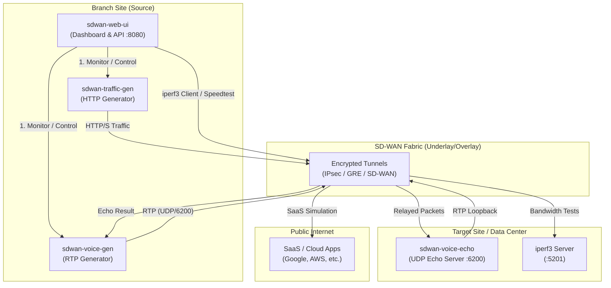

# Technical Communication Flow

This diagram illustrates the flows between the various containers and external targets.

## Protocol & Port Table

| Flow Type | Protocol | Port(s) | Source | Target |
|-----------|----------|---------|--------|--------|
| **Dashboard UI** | TCP | 8080 / 8444 | User Browser | `sdwan-web-ui` |
| **Background HTTP**| TCP | 80, 443 | `sdwan-traffic-gen` | Internet / Cloud |
| **Convergence/Voice**| UDP | 6200 | `sdwan-voice-gen` | `sdwan-voice-echo` |
| **Iperf3 Test** | TCP/UDP | 5201 | `sdwan-web-ui` | `iperf3 server` |
| **Speedtest** | TCP | 80, 443 | `sdwan-web-ui` | Public Ookla Servers |
| **API Control** | TCP | 8080 | Dashboard | Orchestrator Engine |

## Site Cloning (v1.1.2-patch.3+)
When using the **Backup & Restore** feature, you are essentially exporting the logic and site categories from one **Branch Site** (UI side) and importing it into another UI instance to ensure consistent performance testing across the entire SD-WAN fabric.
